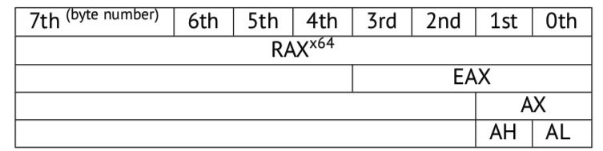
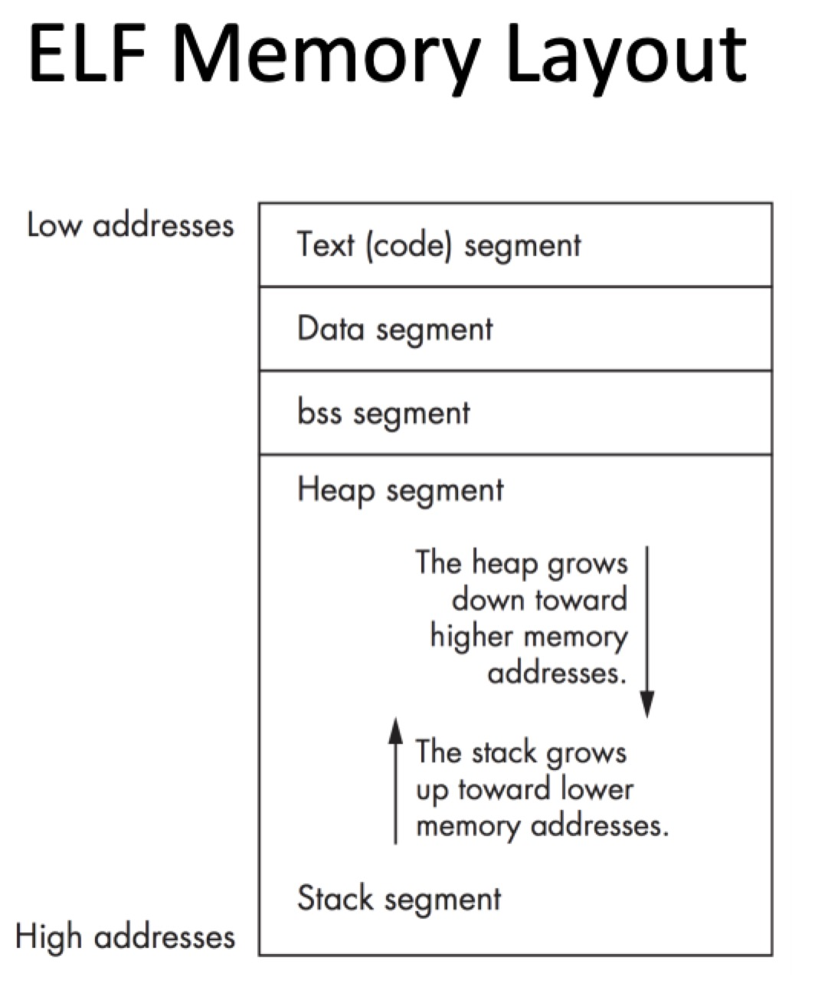
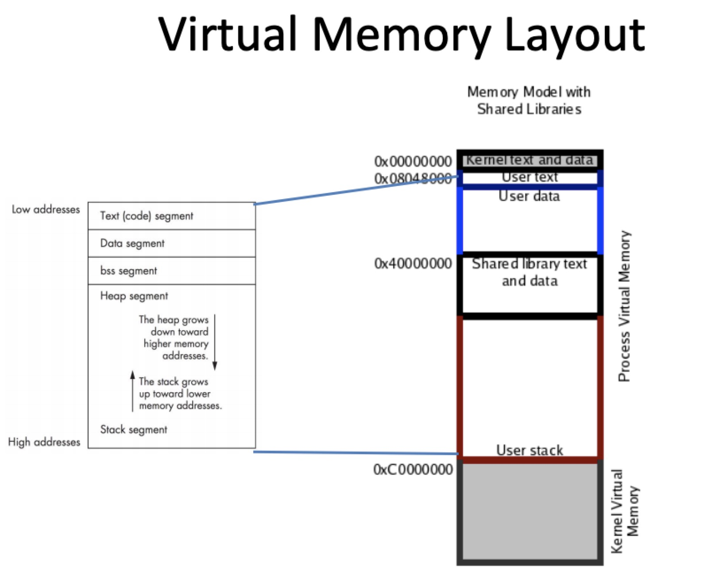
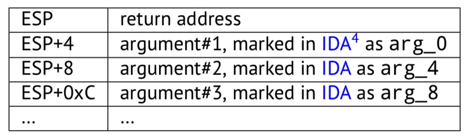

## RE4B-EN-LITE chapter1~5

## chapter 01 CPU简介
- CPU就是用来执行机器码的设备
- 名词解释
    - CPU指令集：寄存器操作、内存操作、算术运算...
    - 机器码：CPU能直接处理，每条指令由多个字节编码
    - 汇编语言：提高机器码的易读性
    - 寄存器
        - 通用寄存器
        - 理解寄存器的最简单方法是将其视为无类型的临时变量
    - 编译器：将高级语言转换为汇编程序

## chapter 02 最简单的函数示例
- 源码
```c
int f() 
{
    return 123;
};
```
- x86汇编
```asm
f:
    mov eax, 123
    ret
```
- eax：通常用来保存返回的结果，调用者可以通过eax获得该结果
- ret：返回到调用者

## chapter 03 Hello,world!
```c
#include <stdio.h>
int main() 
{
    printf("hello, world\n");
    return 0; 
}
```

### 3.1 x86

- MSVC2010编译(1.obj)
    ```asm
    CONST   SEGMENT   ;CONST段保存数据常量
    $SG3830 DB      'hello, world', 0AH, 00H
    CONST   ENDS
    PUBLIC  _main
    EXTRN   _printf:PROC
    ; Function compile flags: /Odtp
    _TEXT   SEGMENT   ;TEXT段保存代码
    _main   PROC
            push    ebp
            mov     ebp, esp
            push    OFFSET $SG3830
            call    _printf
            add     esp, 4
            xor     eax, eax
            pop     ebp
            ret     0
    _main   ENDP
    _TEXT   ENDS
    ```
    - 编译时字符串的形式：const char $SG3830[]="hello, world\n";编译器自动分配一个名字
        - 为const char[]类型，所以后续无法对其进行修改
    - $SG3830 DB      'hello, world', 0AH, 00H
        - C/C++标准中字符串以\x00结尾
    - 函数以PROC(prologue code)开头，以ENDP(epilogue code)结尾
    -  push    OFFSET $SG3830  call    _printf
        - call函数前参数进栈（push）
    - add     esp, 4
        - 调用返回后栈里的string address已经不需要了，清栈
        - == pop
        - 为什么是4？
            - 32位的程序（地址长度），地址用4byte（32/8，4个字节）表示，esp指向栈中1个字节，需要栈里的4个字节
            - sp是字节型单位
    - xor     eax, eax
        - 给寄存器清零
        - == SUB EAX, EAX == MOV EAX, 0
    - ret     0
        - 返回控制权给调用者，对于main来说是操作系统

### 3.2 x86-64
- MSVC—x86-64编译
    ```asm
    $SG2989 DB  'hello, world', 0AH, 00H
    main    PROC 
            sub     rsp, 40
            lea     rcx, OFFSET FLAT:$SG2989
            call    printf
            xor     eax, eax
            add     rsp, 40
            ret     0
    main    ENDP
    ```
    - 所有寄存器扩展为64位（R-），一个正好存储字符串64位的地址
    - lea     rcx, OFFSET FLAT:$SG2989
        - 为了尽量少的操作内存，采用寄存器传递参数
        - 前4个参数使用：RCX、RDX、R8、R9传递
    - 为了向前兼容：
    
    - xor     eax, eax
        - 为了向前兼容，main返回一个int类型（32bit）的数存在eax中呢
    - sub     rsp, 40 ... add     rsp, 40
        - 分配和清理“shadow space“

### 3.3 总结
- x86和x64的区别
    - 指针由32bit扩展为64bit

## chapter04 Function prologue and epilogue（函数定界）
- function prologue 
    ```
    push    ebp
    mov     ebp, esp
    sub     esp, X
    ```
    - 保存ebp的值
    - 将esp的值赋给ebp
    - 在堆栈上为局部变量分配空间
- function epilogue
    ```
    mov    esp, ebp
    pop    ebp
    ret    0
    ```
    - 释放栈中分配的空间
    - 控制权还给调用者

## chapter05 栈
- 本质上：进程空间的一段内存，从高地址到低地址分布
- ESP（RSP、SP2）指向栈顶
- 常用指令：push、pop
    - push：在32位模式下从ESP / RSP / SP中减去4（在64位模式下减8），esp就指向push进去的内容
    - pop：将栈中的数据恢复给指定寄存器，然后esp+4（8）

### 5.1 为什么栈反向生长
- 堆和栈分布在一块内存中，因为不知道两者大小，设计成相对增长
- elf布局



### 5.2 栈的作用
- 保存函数的返回地址
    - 执行CALL
        - call之后的指令地址入栈
        - jmp到调用的函数处执行
    - 执行ReT
        - pop tmp
        - jmp tmp
    - 栈溢出代码举例：
        ```c
        void f() 
        {
            f(); 
        };
        ```
        - 打开编译器优化前
        ```
        ?f@@YAXXZ PROC
        ; File c:\tmp6\ss.cpp
        ; Line 2
        push ebp
                mov     ebp, esp
        ; Line 3
                call    ?f@@YAXXZ
        ; Line 4
                pop     ebp
                ret     0
        ?f@@YAXXZ ENDP
        ```          
        - 打开编译器优化后（不存在栈溢出）
        ```
        ?f@@YAXXZ PROC
        ; File c:\tmp6\ss.cpp
        ; Line 2
        $LL3@f:
        ; Line 3
                jmp     SHORT $LL3@f
        ?f@@YAXXZ ENDP   
        ```
- 为函数传递参数
    - x86中最流行的方法：cdecl(C语言默认的函数调用方法)
    ```
    push arg3
    push arg2
    push arg1
    call f
    add esp, 12 ; 4*3=12
    ```
    
    - 注意：传递参数不一定非要用栈，只是为了方便
    - 被调函数无法知道主调函数传递了多少个参数，类似printf这样的函数通过格式字符串说明符（以％符号开头）确定其数量。因此如何定义main()就没有那么重要了。可以使用main(int argc, char *argv[])或main(int argc, char *argv[], char *envp[])【参数从右向左进栈】，即使不显式声名，这些参数仍然存在于栈中（被调函数传给它的）
    ```
    push envp
    push argv
    push argc
    call main
    ```

- 存储局部变量
    - ESP-4x（减小栈底指针）
    - 不是强制规定

- x86: alloca()
    - _alloca是在栈(stack)上申请空间,该变量离开其作用域之后被自动释放，无需手动调用释放，因为在函数末尾会将esp还原（向栈底移动）
    - 源码：
        ```c
        #ifdef __GNUC__
        #include <alloca.h> // GCC
        #else
        #include <malloc.h> // MSVC
        #endif
        #include <stdio.h>
        void f() {
            char *buf=(char*)alloca (600);
        #ifdef __GNUC__
            snprintf (buf, 600, "hi! %d, %d, %d\n", 1, 2, 3); // GCC
        #else
            _snprintf (buf, 600, "hi! %d, %d, %d\n", 1, 2, 3); // MSVC
        #endif
            puts (buf);
        };
        ```
        - _snprintf():将数据写到buf中
        - puts：将buf中的内容输出到标准输出
    - 反汇编：
        ```asm
        mov    eax, 600
        call   __alloca_probe_16
        mov    esi, esp
        ; 00000258H
        push   3
        push   2
        push   1
        push   OFFSET $SG2672
        push   600
        push   esi #buf
        call   __snprintf
        push   esi #buf
        call   _puts
        add    esp, 28
        ; 00000258H
        ; 0000001cH
        ```
        - 传递给alloca()的参数放到eax里
        - add    esp, 28
            - esp重新指向刚初始化时的buf区域（共push了7次，4x7=28byte）

- (Windows) SEH
    - SEH是window操作系统默认的异常处理机制
    - 调试的时候经常触发5种最具代表性的异常：
        - EXCEPTION_ACCESS_VIOLATION     0xC0000005    
            - 程序企图读写一个不可访问的地址时引发的异常（不存在，或者不具有访问权限）。例如企图读取0地址处的内存。
        - EXCEPTION_BREAKPOINT  0x80000003  
            - 触发断点时引发的异常。在运行的代码中设置断点以后，cpu尝试执行该处的指令时将触发队形的EXCEPTION_BREAKPOINT异常
                INT3,设置断点对应的汇编指令为INT3,对应的机器指令为0xCC.灵活运用这个原理可以为程序运行带来很大的便利。比如使用hex editor打开PE文件，修改EP地址对应的文件偏移处的第一个字节为0xCC,然后运行该PE文件就会发EXCEPTION_BREAKPOINT异常，经过OS的默认异常处理后会终止程序运行，若在操作系统的注册表中将默认调试器设置为OllyDbg，那么发生以上异常时OS会自动运行ollydbg调试器，附加发生异常的进程。
        - EXCEPTION_ILLEGAL_INSTRUCTION  0xC000001D    
            - 程序企图执行一个无效的指令时引发该异常。
        - EXCEPTION_INT_DIVIDE_BY_ZERO   0xC0000094   
            - 整数除法的除数是0时引发该异常。
        - EXCEPTION_SINGLE_STEP   0x80000004    
            - 标志寄存器的TF位为1时，每执行一条指令就会引发该异常。主要用于单步调试。
    - SEH链
        - SEH以链的形式存在。第一个异常处理中未处理相关异常，它就会被传递到下一个异常处理器，直到得到处理。SEH是由_EXCEPTION_REGISTRATION_RECORD结构体组成的链表
        - SEH结构体中，Next成员指向下一个_EXCEPTION_REGISTRATION_RECORD结构体指针，handler成员是异常处理函数（异常处理器）。若Next成员的值为FFFFFFFF，则表示它是链表最后一个结点

- 缓冲区溢出保护
- 自动重新分配栈中的数据
    - 和堆相比不用显示释放内存空间，存储局部变量在函数退出时能自动释放（ADD），参数在函数结尾也同理

### 5.3 典型的栈布局（32位）

