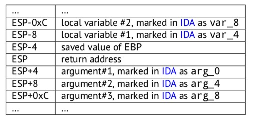

## RE4B-EN-LITE chapter6～10

## chapter 06 带一些参数的printf()

### 6.1  x86
```c
#include <stdio.h>
int main() 
{
    printf("a=%d; b=%d; c=%d", 1, 2, 3);
    return 0; 
};
```
-  MSVC 2010编译
    ```asm
    $SG3830 DB      'a=%d; b=%d; c=%d', 00H
    ...
            push    3
            push    2
            push    1
            push    OFFSET $SG3830
            call    _printf
    add esp, 16
    ; 00000010H
    ```
    - 参数倒序入栈
    - 32位程序，int占4个字节，push进5个4字节参数，在栈中占16个字节(X)的位置（1个32位的指向字符串的指针+3个int型数据），求参数个数（X/4)
    - 特殊情况：连续push-call的情况下编译器可以在最后再清栈（ADD ESP,X)
        ```asm
        push    3
        call    sub_100018B0 ; takes one argument (3)
        call    sub_100019D0 ; takes no arguments at all
        call    sub_10006A90 ; takes no arguments at all
        push    1
        call    sub_100018B0 ; takes one argument (1)
        add     esp, 8       ; drops two arguments from stack at once
        ```

### 6.2 x64: 8 arguments
```c
#include <stdio.h>
int main() 
{
    printf("a=%d; b=%d; c=%d; d=%d; e=%d; f=%d; g=%d; h=%d\n", 1, 2, 3, 4, 5, 6, 7, 8);
    return 0; 
};
```
-  MSVC 2010编译
    ```asm
    $SG2923 DB 'a=%d; b=%d; c=%d; d=%d; e=%d; f=%d; g=%d; h=%d', 0aH, 00H
    main PROC 
        sub     rsp, 88
        mov     DWORD PTR [rsp+64], 8
        mov     DWORD PTR [rsp+56], 7
        mov     DWORD PTR [rsp+48], 6
        mov     DWORD PTR [rsp+48], 6
        mov     DWORD PTR [rsp+40], 5
        mov     DWORD PTR [rsp+32], 4
        mov     r9d, 3
        mov     r8d, 2
        mov     edx, 1
        lea     rcx, OFFSET FLAT:$SG2923
        call    printf
        ; return 0
        xor     eax, eax
        add     rsp, 88
        ret     0
    main    ENDP
    _TEXT   ENDS
    END
    ```
    - 前四个参数放在： RCX, RDX, R8, R9
    - 用mov代替push向栈中放入剩余参数
    - 为什么用8字节存储int类型：64位程序中用8字节存储所有<=8byte的数据类型，这样会降低计算参数地址的难度。（32位用4byte存储同理）

### 6.3 结论
- x86
```
...
PUSH 3rd argument
PUSH 2nd argument
PUSH 1st argument
CALL function
; modify stack pointer (if needed)
```
- x64
```
MOV RCX, 1st argument
MOV RDX, 2nd argument
MOV R8, 3rd argument
MOV R9, 4th argument
...
PUSH ...th, 6th, 5th argument, etc (if needed)
CALL function
; modify stack pointer (if needed)
```


## chapter 07 scanf()

### 7.1 简单的示例
- 用来说明传递一个指向int类型变量的指针。
```c
#include <stdio.h>
int main() 
{
    int x;
    printf ("Enter X:\n");
    scanf ("%d", &x);
    printf ("You entered %d...\n", x);
    return 0; 
};
```
- 指针
    - 通常将大型数组、结构体等对象传递给其他函数开销是很大的（回传更是荒谬），传递它的地址更简单一点。指针就是表示内存中的地址。
    - x86中，地址用32bit表示
    - x86-64中，地址用64bit表示
    - 使用无类型指针是可能的;例如，标准的C函数memcpy()将一个块从一个内存位置复制到另一个内存位置，它将void*类型的两个指针作为参数，因为不可能预测要复制的数据的类型。数据类型并不重要，重要的是块大小。
    - 指针还常在函数返回多个值时使用
    - 在C/C++中，指针类型只用于编译时类型检查。内部在编译的代码中根本没有指针类型的信息。

- x86 MSVC 2010编译
    ```asm
    CONST    SEGMENT
    $SG3831 DB   'Enter X:', 0aH, 00H
    $SG3832 DB   '%d', 00H
    $SG3833 DB   'You entered %d...', 0aH, 00H
    CONST    ENDS
    PUBLIC    _main
    EXTRN    _scanf:PROC
    EXTRN    _printf:PROC
    ; Function compile flags: /Odtp
    _TEXT    SEGMENT
    _x$=-4 ; size = 4 
    _main PROC
        push   ebp
        mov    ebp, esp
        push   ecx
        push   OFFSET $SG3831 ; 'Enter X:'
        call   _printf
        add    esp, 4
        lea    eax, DWORD PTR _x$[ebp]
        push   eax
        push   OFFSET $SG3832 ; '%d'
        call   _scanf
        add    esp, 8
        mov    ecx, DWORD PTR _x$[ebp]
        push   ecx
        push   OFFSET $SG3833 ; 'You entered %d...'
        call   _printf
        add    esp, 8
        ; return 0
        xor    eax, eax
        mov    esp, ebp
        pop    ebp
        ret    0
    _main    ENDP
    _TEXT    ENDS
    ```
    - x:局部变量，仅在这个函数中可见
    - push ecx：不是为了保存ecx的状态（因为结尾没有再pop ecx），这里是为了存储变量x，在栈上分配了4字节的大小
    - 使用ebp-4（_x$）访问x（EBP的值可以被理解为ESP中在函数执行开始时的保留状态）
    
    - scanf的参数：指向包含 %d 的字符串的指针 & 局部变量x的地址
    - lea eax, DWORD PTR _x$[ebp]：将x的地址给eax（== lea eax,[ebp-4] eax==ebp-4)
    - printf的参数：指向包含 “You entered %d...\n.” 的字符串的指针 和 x的值
    -  mov ecx, [ebp-4]：将x的值（不是地址！！）给ecx

- x64 MSVC
```asm
_DATA   SEGMENT
$SG1289 DB      'Enter X:', 0aH, 00H
$SG1291 DB      '%d', 00H
$SG1292 DB      'You entered %d...', 0aH, 00H
_DATA   ENDS

_TEXT   SEGMENT
x$ = 32
main    PROC
$LN3:
        sub     rsp,56
        lea     rcx,OFFSET FLAT:$SG1289  ; 'Enter X:'
        call    printf
        lea     rdx, QWORD PTR x$[rsp]
        lea     rcx, OFFSET FLAT:$SG1291 ; '%d'
        call    scanf
        mov     edx, DWORD PTR x$[rsp]
        lea     rcx, OFFSET FLAT:$SG1292 ; 'You entered %d...'
        call    printf
        ; return 0
        xor     eax, eax
        add     rsp, 56
        ret     0
main    ENDP
_TEXT   ENDS
```

### 7.2 全局变量
- 全局变量可以在任意位置访问到
```c
#include <stdio.h>
// now x is global variable
int x;
int main() 
{
    printf ("Enter X:\n");
    scanf ("%d", &x);
    printf ("You entered %d...\n", x);
    return 0; 
};
```

- MSVC: x86
    ```asm
    _DATA    SEGMENT
    COMM    _x:DWORD
    $SG2456 DB      'Enter X:', 0aH, 00H
    $SG2457 DB      '%d', 00H
    $SG2458 DB      'You entered %d...', 0aH, 00H
    _DATA    ENDS
    PUBLIC    _main
    EXTRN    _scanf:PROC
    EXTRN    _printf:PROC
    ; Function compile flags: /Odtp
    _TEXT    SEGMENT
    _main    PROC
        push   ebp
        mov    ebp, esp
        push   OFFSET $SG2456
        call   _printf
        add    esp, 4
        push   OFFSET _x
        push   OFFSET $SG2457
        call   _scanf
        add    esp, 8
        mov    eax, DWORD PTR _x
        push   eax
        push   OFFSET $SG2458
        call   _printf
        add    esp, 8
        xor    eax, eax
        pop    ebp
        ret    0
    _main    ENDP
    _TEXT    ENDS
    ```
    - x在_DATA段中定义，在本地栈中不分配内存，它是被直接访问的，不再通过访问栈中的地址。未初始化的全局变量在可执行文件中不占任何空间。exe加载起来才会为这些变量分配空间。
    - 例如：
    ```c
    int x=10; // default value
    ```
    ```asm
    _DATA   SEGMENT
    _x      DD      0aH
    ```
    - 当x被初始化，在ida中可以看到x在_DATA段的起始，后面跟着其他字符串
    - 当x未被初始化，_x被标记为？，和其他不需要初始化的变量放在一起
    

- MSVC: x64
    ```
    _DATA    SEGMENT
    COMM    _x:DWORD
    $SG2456 DB      'Enter X:', 0aH, 00H
    $SG2457 DB      '%d', 00H
    $SG2458 DB      'You entered %d...', 0aH, 00H
    _DATA    ENDS
    _TEXT    SEGMENT
    main     PROC
    $LN3:
        sub     rsp, 40
        lea     rcx, OFFSET FLAT:$SG2924  ; 'Enter X:'
        call    printf
        lea     rdx, OFFSET FLAT:x
        lea     rcx, OFFSET FLAT:$SG2925 ; '%d'
        call    scanf
        mov     edx, DWORD PTR x
        lea     rcx, OFFSET FLAT:$SG2926 ; 'You entered %d...'
        call    printf
        ; return 0
        xor     eax, eax
        add rsp, 40
        ret     0
    main    ENDP
    _TEXT ENDS
    ```
    - mov     edx, DWORD PTR x：x为DWORD32bit，MOV操作中必须用对应位数的寄存器放

### 7.3 检测scanf()的返回结果
```c
#include <stdio.h>
int main() 
{
    int x;
    printf ("Enter X:\n");
    if (scanf ("%d", &x)==1)
        printf ("You entered %d...\n", x);
    else
        printf ("What you entered? Huh?\n");
    return 0; 
};
```
- scanf返回成功读取的个数
- MSVC: x86
    ```asm
        lea     eax, DWORD PTR _x$[ebp]
        push    eax
        push    OFFSET $SG3833 ; '%d', 00H
        call    _scanf
        add     esp, 8
        cmp     eax, 1
        jne     SHORT $LN2@main
        mov     ecx, DWORD PTR _x$[ebp]
        push    ecx
        push    OFFSET $SG3834 ; 'You entered %d...', 0aH, 00H
        call    _printf
        add     esp, 8
        jmp     SHORT $LN1@main
    $LN2@main:
        push    OFFSET $SG3836 ; 'What you entered? Huh?', 0aH, 00H
        call    _printf
        add     esp, 4
    $LN1@main:
        xor     eax, eax
    ```
    - CMP EAX, 1:=：检查返回结果（对ZF位进行操作）
    - JNE：不等于则跳转（ZF=0）== JNZ
    - xor     eax, eax：main函数return 0
    - CMP&JCC
        - CMP其实是执行的不保留结果的SUB操作，所有的算术操作都会有改变eflags的可能

- MSVC: x64
    ```asm
    _DATA   SEGMENT
    $SG2924 DB      'Enter X:', 0aH, 00H
    $SG2926 DB      '%d', 00H
    $SG2927 DB      'You entered %d...', 0aH, 00H
    $SG2929 DB      'What you entered? Huh?', 0aH, 00H
    _DATA   ENDS
    _TEXT   SEGMENT
    x$ = 32
    main    PROC
    $LN5:
            sub     rsp, 56
            lea     rcx, OFFSET FLAT:$SG2924 ; 'Enter X:'
            call    printf
            lea     rdx, QWORD PTR x$[rsp]
            lea     rcx, OFFSET FLAT:$SG2926 ; '%d'
            call    scanf
            cmp     eax, 1
            jne     SHORT $LN2@main
            mov     edx, DWORD PTR x$[rsp]
            lea     rcx, OFFSET FLAT:$SG2927 ; 'You entered %d...'
            call    printf
            jmp     SHORT $LN1@main
    $LN2@main:
            lea     rcx, OFFSET FLAT:$SG2929 ; 'What you entered? Huh?'
            call    printf
    $LN1@main:
            ; return 0
            xor     eax, eax
            add     rsp, 56
            ret     0
    main    ENDP
    _TEXT   ENDS
    END
    ```
- MSVC: x86 + Hiew
    - 给程序打补丁，使其无论我们的输入是什么都将其打印出来（即调跳过错误判断）
    
    - 方法一：将JNZ改成NOP
    - 方法二：改变JNZ的地址为0，使其接着执行下一行指令

### 7.4 Exercise

- rdx保存的是Goodbye的值，[rax]保存的是rax的值，rax的值是“Hello，World！”的地址，因此产生覆盖错误


## chapter 08 处理传参
- 调用函数通过栈给被调用函数传参，被调用函数是如何接收参数的呢？
- 一个简单的例子：
```c
#include <stdio.h>
int f (int a, int b, int c)
{
    return a*b+c;
};
int main() 
{
    printf ("%d\n", f(1, 2, 3));
    return 0; 
};
```
### 8.1 x86
- MSVC 2010编译
    ```asm
    _TEXT   SEGMENT
    $SG2997 DB  '%d', 0aH, 00H
    _a$ = 8             ; size = 4
    _b$ = 12            ; size = 4
    _c$ = 16            ; size = 4
    _f      PROC
            push    ebp
            mov     ebp, esp
            mov     eax, DWORD PTR _a$[ebp]
            imul    eax, DWORD PTR _b$[ebp]
            add     eax, DWORD PTR _c$[ebp]
            pop     ebp
            ret     0
    _f      ENDP

    _main   PROC
            push    ebp
            mov     ebp, esp
            push    3 ; 3rd argument
            push    2 ; 2nd argument
            push    1 ; 1st argument
            call    _f
            add     esp, 12 ;3x4byte
            push    eax 
            push    OFFSET $SG2463 ; '%d', 0aH, 00H
            call    _printf
            add     esp, 8 ;2x4byte
            ; return 0
            xor     eax, eax
            pop     ebp
            ret     0
    _main   ENDP
    ```
    - main将3个参数放到栈上，然后调用f()
    。f通过宏的方式访问参数，例如：DWORD PTR _a$[ebp]，即表示访问[ebp+$_a]地址处的内容。栈中的值赋值给eax寄存器，最终函数调用的结果也是存储在eax寄存器中，调用函数通过访问eax就能获得被调函数返回的结果。

### 8.2 x64
- 在x86-64中，情况有些不同。函数参数(前4个或前6个)在寄存器中传递，即被调用者从寄存器中读取它们，而不是从堆栈中读取它们。
    ```asm
    $SG2997 DB  '%d', 0aH, 00H
    main    PROC 
            sub     rsp, 40
            mov     edx, 2
            lea     r8d, QWORD PTR [rdx+1] ; R8D=3
            lea     ecx, QWORD PTR [rdx-1] ; ECX=1
            call    f
            lea     rcx, OFFSET FLAT:$SG2997 ;'%d'
            mov     edx, eax
            call    printf
            xor     eax, eax
            add     rsp, 40
            ret     0
    main    ENDP
    f       PROC
            ; ECX - 1st argument
            ; EDX - 2nd argument
            ; R8D - 3rd argument
            imul    ecx, edx
            lea     eax, DWORD PTR [r8+rcx]
            ret     0
    f ENDP
    ```
    - x64中，f()从寄存器中获取所有参数。显然，编译器认为它比ADD要快。main()函数也使用LEA来准备第一个和第三个f()参数，编译器一定认为这比通常使用MOV指令将值加载到寄存器的方法要快。

- 未经优化的MSVC 2012 x64输出：
    ```asm
    f       proc near
    ; shadow space:
    arg_0   = dword ptr  8
    arg_8   = dword ptr  10h
    arg_10  = dword ptr  18h

            ; ECX - 1st argument
            ; EDX - 2nd argument
            ; R8D - 3rd argument
            mov     [rsp+arg_10], r8d
            mov     [rsp+arg_8], edx
            mov     [rsp+arg_0], ecx
            mov     eax, [rsp+arg_0]
            imul    eax, [rsp+arg_8]
            add     eax, [rsp+arg_10]
            retn
    f       endp

    main    proc near
            sub     rsp, 28h
            mov     r8d,3; 3rd argument
            mov     edx,2; 2nd argument
            mov     ecx,1; 1st argument
            call    f
            mov     edx, eax
            lea     rcx, $SG2931    ; "%d\n"
            call    printf
                    
            ; return 0
            xor     eax, eax
            add     rsp, 28h
            retn
    main    endp
    ```
    - 三个寄存器中的参数都保存在栈上，这段区域叫做“shadow space” 。所有的Win64程序通常把前四个寄存器的值放在这里。这样做的原因有两个：
        - 1）为一个输入参数分配一个寄存器太浪费了，所以通过栈来访问它
        - 2）当中断时，调试器将知道在哪里访问它们

    - 因此，如果在函数执行过程中调用者需要使用输入给被调用者的参数，一些大型函数可以将它们保存在“shadow space”中，但有些小函数(如我们的函数)可能做不到这一点。
    - 调用者负责在栈中分配“shadow space”。

## Chapter 09 更多关于结果返回（ret）
- x86中结果通常保存在eax中返回。如果返回值是byte类型的或者是char类型的，就只使用EAX的低字节（AL）。如果返回值是float类型的，FPU（算数浮点单元）寄存器ST(0)替代eax存放该值。
    - FPU 不使用通用寄存器 (EAX、EBX 等等)。反之，它有自己的一组寄存器，称为寄存器栈 (register stack)。数值从内存加载到寄存器栈，然后执行计算，再将堆栈数值保存到内存。

### 9.1 尝试使用类型为void的返回值
- 调用main的代码如下：
```
push envp
push argv
push argc
call main
push eax
call exit
```
- 也就是：exit(main(argc,argv,envp))
- 如果main的返回值声名为void类型，那么eax中的值是垃圾值，
```c
#include <stdio.h>
void main() 
{
    printf ("Hello, world!\n");
};
```
- GCC 4.8.1编译
    - puts()替换了printf(),main函数最后eax中仍遗留着调用puts()时留在里面的值（打印的字符个数）
    ```
    .LC0:
        .string "Hello, world!"
    main:
        push    ebp
        mov     ebp, esp
        and     esp, -16
        sub     esp, 16
        mov     DWORD PTR [esp], OFFSET FLAT:.LC0
        call    puts
        leave
        ret
    ```

### 9.2 如果我们不使用函数的结果呢？
- 会覆盖
```c
int f() {
    // skip first 3 random values
    rand();
    rand();
    rand();
    // and use 4th
    return rand();
};
```
- rand()的结果放在eax中，最终返回的只是第四次rand()生成的随机数


## Chapter 10 GOTO 操作
```c
#include <stdio.h>
int main() {
        printf ("begin\n");
        goto exit;
        printf ("skip me!\n");
    exit:
        printf ("end\n");
};
```
-  MSVC 2012
    ```c
    $SG2934 DB  'begin', 0aH, 00H
    $SG2936 DB  'skip me!', 0aH, 00H
    $SG2937 DB  'end', 0aH, 00H
    _main   PROC
            push    ebp
            mov     ebp, esp
            push    OFFSET $SG2934 ; 'begin'
            call    _printf
            add     esp, 4
            jmp     SHORT $exit$3
            push    OFFSET $SG2936 ; 'skip me!'
            call    _printf
            add     esp, 4
    $exit$3:
            push    OFFSET $SG2937 ; 'end'
            call    _printf
            add     esp, 4
            xor     eax, eax
            pop     ebp
            ret     0
    _main   ENDP
    ```
    - GOTO语句实质上就是jmp操作

### 10.1 死代码
- 上述代码中的第2个printf()就是死代码，正常情况下永远执行不到。所以当使用编译优化时，编译器会自动忽略它们。
- 但是死代码相关的全局变量还在
```c
$SG2981 DB
$SG2983 DB
$SG2984 DB
_main   PROC
        push
'begin', 0aH, 00H
'skip me!', 0aH, 00H
'end', 0aH, 00H
OFFSET $SG2981 ; 'begin'
call    _printf
push    OFFSET $SG2984 ; 'end'
$exit$4:
        call    _printf
        add     esp, 8
        xor     eax, eax
        ret     0
_main ENDP
```