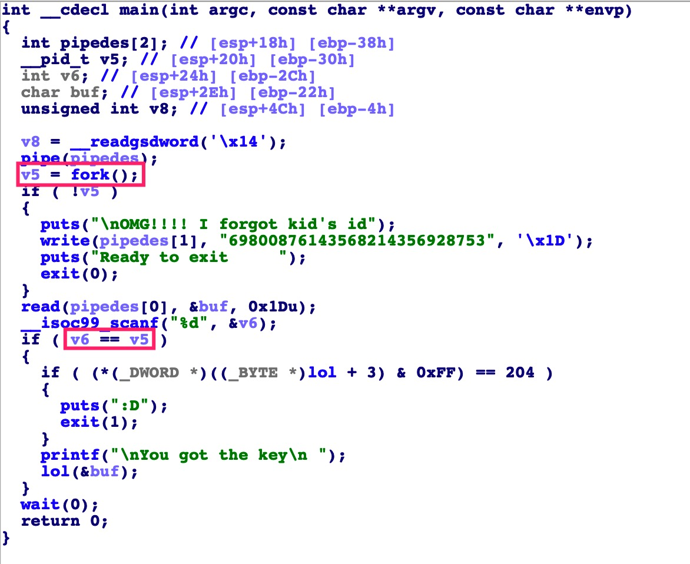
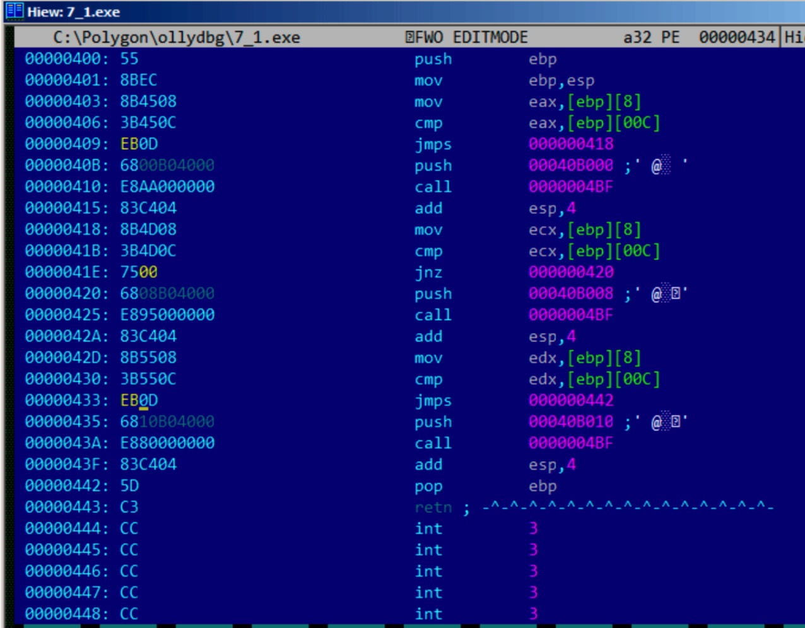

## RE4B-EN-LITE chapter11~15

## chapter 11 条件跳转

### 11.1 一个简单的例子
```c
#include <stdio.h>
void f_signed (int a, int b)
{
    if (a>b)
        printf ("a>b\n");
    if (a==b)
        printf ("a==b\n");
    if (a<b)
        printf ("a<b\n");
};
void f_unsigned (unsigned int a, unsigned int b)
{
    if (a>b)
        printf ("a>b\n");
    if (a==b)
        printf ("a==b\n");
    if (a<b)
        printf ("a<b\n");
};
int main() {
    f_signed(1, 2);
    f_unsigned(1, 2);
    return 0;
};
```

- x86 + MSVC
    -  f_signed() 
    ```c
    _a$ = 8
    _b$ = 12
    _f_signed PROC
        push   ebp
        mov    ebp, esp
        mov    eax, DWORD PTR _a$[ebp]
        cmp    eax, DWORD PTR _b$[ebp]
        jle    SHORT $LN3@f_signed
        push   OFFSET $SG737        ; 'a>b'
        call   _printf
        add    esp, 4
    $LN3@f_signed:
        mov    ecx, DWORD PTR _a$[ebp]
        cmp    ecx, DWORD PTR _b$[ebp]
        jne    SHORT $LN2@f_signed
        push   OFFSET $SG739        ; 'a==b'
        call   _printf
        add    esp, 4
    $LN2@f_signed:
        mov    edx, DWORD PTR _a$[ebp]
        cmp    edx, DWORD PTR _b$[ebp]
        jge    SHORT $LN4@f_signed
        push   OFFSET $SG741        ; 'a< b'
        call   _printf
        add    esp, 4
    $LN4@f_signed:
        pop    ebp
        ret    0
    _f_signed ENDP
    ```
    - JLE：小于等于时跳转，当第二个操作数比第一个操作数小或者相等时会发生跳转
    - JNE：不等于跳转（Jump if Not Equal），第二个操作数和第一个操作数不相等时发生跳转
    - JGE：大于等于时跳转，当第一个操作数比第二个操作数大或者相等时会发生跳转

    - f_unsigned()
    ```c
    _a$=8 ;size=4 
    _b$=12 ;size=4 
    _f_unsigned PROC
        push   ebp
        mov    ebp, esp
        mov    eax, DWORD PTR _a$[ebp]
        cmp    eax, DWORD PTR _b$[ebp]
        jbe    SHORT $LN3@f_unsigned
        push   OFFSET $SG2761    ; 'a>b'
        call   _printf
        add    esp, 4
    $LN3@f_unsigned:
        mov    ecx, DWORD PTR _a$[ebp]
        cmp    ecx, DWORD PTR _b$[ebp]
        jne    SHORT $LN2@f_unsigned
        push   OFFSET $SG2763    ; 'a==b'
        call   _printf
        add    esp, 4
    $LN2@f_unsigned:
        mov    edx, DWORD PTR _a$[ebp]
        cmp    edx, DWORD PTR _b$[ebp]
        jae    SHORT $LN4@f_unsigned
        push   OFFSET $SG2765   ; 'a< b'
        call   _printf
        add    esp, 4
    $LN4@f_unsigned:
        pop    ebp
        ret    0
    _f_unsigned ENDP

    ```
    - 无符号数之间的比较
        - JBE—Jump if Below or Equal
        - JAE—Jump if Above or Equal

- x86 + MSVC + Hiew
    - 操作效果：使f_unsigned() 函数总是打印a==b
    
    - 思路：
        - jle跳转：总是成立
        - jnz跳转：永不成立
        - jge跳转：总是成立
    - 操作：
        - jle、jge改成jmp
        - jnz修改offset为0，程序接着执行下一条指令
        
    
### 11.2 计算绝对值
```c
int my_abs (int i)
{
    if (i<0)
        return -i;
    else
        return i;
};
```
- MSVC带优化选项编译
    ```c
    i$ = 8
    my_abs  PROC
    ; ECX = input
            test    ecx, ecx
    ; check for sign of input value
    ; skip NEG instruction if sign is positive
            jns     SHORT $LN2@my_abs
    ; negate value
            neg     ecx
    $LN2@my_abs:
    ; prepare result in EAX:
            mov     eax, ecx
            ret     0
    my_abs  ENDP
    ```
    - jns：符号位为0时跳转（ecx中为正数）
    - neg ecx：ecx=-ecx

### 11.3 三目运算 expression ? expression : expression
```c
const char* f (int a)
{
    return a==10 ? "it is ten" : "it is not ten";
};
```
- x86
    ```c
    $SG746  DB      'it is ten', 00H
    $SG747  DB      'it is not ten', 00H
    tv65 = -4 ; 临时变量，用于存储待打印的字符串，最后赋值给eax返回。
    _a$ = 8
    _f      PROC
            push    ebp
            mov     ebp, esp
            push    ecx
    ; compare input value with 10
            cmp     DWORD PTR _a$[ebp], 10
    ; jump to $LN3@f if not equal
            jne     SHORT $LN3@f
    ; store pointer to the string into temporary variable:
            mov     DWORD PTR tv65[ebp], OFFSET $SG746 ; 'it is ten'
    ; jump to exit
            jmp     SHORT $LN4@f
    $LN3@f:
    ; store pointer to the string into temporary variable:
            mov     DWORD PTR tv65[ebp], OFFSET $SG747 ; 'it is not ten'
    $LN4@f:
    ; this is exit. copy pointer to the string from temporary variable to EAX.
            mov     eax, DWORD PTR tv65[ebp]
            mov     esp, ebp
            pop     ebp
            ret     0
    _f ENDP
    ```
    - 使用比较判断跳转位置

- Optimizing MSVC 2008（带优化器）
    ```c
    $SG792  DB      'it is ten', 00H
    $SG793  DB      'it is not ten', 00H
    _a$ = 8 ; size = 4
    _f      PROC
    ; compare input value with 10
        cmp     DWORD PTR _a$[esp-4], 10
        mov     eax, OFFSET $SG792 ; 'it is ten'
    ; jump to $LN4@f if equal
        je      SHORT $LN4@f
        mov     eax, OFFSET $SG793 ; 'it is not ten'
    $LN4@f:
        ret 0 
    _f ENDP
    ```
    - 只使用了一个跳转，未跳转后面直接覆盖

- Optimizing MSVC 2012 x64
    ```c
    $SG1355 DB      'it is ten', 00H
    $SG1356 DB      'it is not ten', 00H
    a$ = 8
    f       PROC
    ; load pointers to the both strings
            lea     rdx, OFFSET FLAT:$SG1355 ; 'it is ten'
            lea     rax, OFFSET FLAT:$SG1356 ; 'it is not ten'
    ; compare input value with 10
            cmp     ecx, 10
    ; if equal, copy value from RDX ("it is ten")
    ; if not, do nothing. pointer to the string "it is not ten" is still in RAX as for now.
            cmove   rax, rdx
            ret 0 
    f ENDP
    ```
    - lea代替mov
    - **cmove**代替跳转进行判断rax最终的值
    - Optimizing GCC 4.8 for x86 也同样适用CMOVE指令优化

- 使用if/else重写三目运算符
    ```c
    const char* f (int a)
    {
        if (a==10)
            return "it is ten";
        else 
            return "it is not ten";
    };
    ```
    - optimizing GCC 4.8 for x86
        ```c
        .LC0:
            .string "it is ten"
        .LC1:
            .string "it is not ten"
        f:
        .LFB0:
        ; compare input value with 10
                cmp     DWORD PTR [esp+4], 10
                mov     edx, OFFSET FLAT:.LC1 ; "it is not ten"
                mov     eax, OFFSET FLAT:.LC0 ; "it is ten"
        ; if comparison result is Not Equal, copy EDX value to EAX
        ; if not, do nothing
                cmovne  eax, edx
                ret
        ```
        - optimizing MSVC 2012 仍使用条件判断，和使用三目运算时优化不同

### 11.4 求最值
- 32-bit
    ```c
    int my_max(int a, int b)
    {
        if (a>b)
                return a;
        else
                return b;
    };
    int my_min(int a, int b)
    {
        if (a<b)
                return a;
        else
                return b;
    };
    ```
    -  Non-optimizing MSVC 2013
    ```c
    _a$ = 8
    _b$ = 12
    _my_min PROC
            push    ebp
            mov     ebp, esp
            mov     eax, DWORD PTR _a$[ebp]
    ; compare A and B:
            cmp     eax, DWORD PTR _b$[ebp]
    ; jump, if A is greater or equal to B:
            jge     SHORT $LN2@my_min
    ; reload A to EAX if otherwise and jump to exit
            mov     eax, DWORD PTR _a$[ebp]
            jmp     SHORT $LN3@my_min
            jmp     SHORT $LN3@my_min ; this is redundant JMP
    $LN2@my_min:
    ; return B
            mov     eax, DWORD PTR _b$[ebp]
    $LN3@my_min:
            pop     ebp
            ret     0
    _my_min ENDP
    _a$ = 8
    _b$ = 12
    _my_max PROC
            push    ebp
            mov     ebp, esp
            mov     eax, DWORD PTR _a$[ebp]
    ; compare A and B:
            cmp     eax, DWORD PTR _b$[ebp]
    ; jump if A is less or equal to B:
            jle     SHORT $LN2@my_max
    ; reload A to EAX if otherwise and jump to exit
            mov     eax, DWORD PTR _a$[ebp]
            jmp     SHORT $LN3@my_max
            jmp     SHORT $LN3@my_max ; this is redundant JMP
    $LN2@my_max:
    ; return B
            mov     eax, DWORD PTR _b$[ebp]
    $LN3@my_max:
            pop     ebp
            ret     0
    _my_max ENDP
    ```
    - a>b，判断jge a,b
    - a< b，判断jle a,b

### 11.5 结论
- 条件跳转总体框架
```c
CMP register, register/value
Jcc true ; cc=condition code
false:
... some code to be executed if comparison result is false ...
JMP exit
true:
... some code to be executed if comparison result is true ...
exit:
```
- 当条件跳转指令的主体很短时，可以使用条件move指令
    - MOVcc in ARM (in ARM mode)
    - CSEL in ARM64
    - CMOVcc in x86


## chapter 12 switch()/case/default
### 12.1 举例
```c
include <stdio.h>
void f (int a)
{
    switch (a)
    {
    case 0: printf ("zero\n"); break;
    case 1: printf ("one\n"); break;
    case 2: printf ("two\n"); break;
    default: printf ("something unknown\n"); break;
    };
};
int main() {
    f (2); // test
};
```
- Non-optimizing MSVC 2010 x86
    ```c
    tv64 = -4 ; size = 4 
    _a$=8 ;size=4 
    _f PROC
        push   ebp
        mov    ebp, esp
        push   ecx      ;ecx中存储的是输入的变量，将输入值压栈后，接下来通过栈中位置访问
        mov    eax, DWORD PTR _a$[ebp]
        mov    DWORD PTR tv64[ebp], eax
        cmp    DWORD PTR tv64[ebp], 0
        je     SHORT $LN4@f
        cmp    DWORD PTR tv64[ebp], 1
        je     SHORT $LN3@f
        cmp    DWORD PTR tv64[ebp], 2
        je     SHORT $LN2@f
        jmp    SHORT $LN1@f
    $LN4@f:
        push   OFFSET $SG739 ; 'zero', 0aH, 00H
        call   _printf
        add    esp, 4
        jmp    SHORT $LN7@f
    $LN3@f:
        push   OFFSET $SG741 ; 'one', 0aH, 00H
        call   _printf
        add    esp, 4
        jmp    SHORT $LN7@f
    $LN2@f:
        push   OFFSET $SG743 ; 'two', 0aH, 00H
        call   _printf
        add    esp, 4
        jmp    SHORT $LN7@f
    $LN1@f:
        push   OFFSET $SG745 ; 'something unknown', 0aH, 00H
        call   _printf
        add    esp, 4
    $LN7@f:
        mov    esp, ebp
        pop ebp
        ret 0 
    _f ENDP
    ```
    - 相当于使用if...else if...else结构
    - 这个汇编中无法区分源代码中使用的是if还是switch
    - 判断之前，编译器将输入的参数a赋值给了一个局部变量tv64

- optimization in MSVC (/Ox): cl 1.c /Fa1.asm /Ox
    ```c
    _a$ = 8 ; size = 4
    _f    PROC
        mov    eax, DWORD PTR _a$[esp-4]
        sub    eax, 0
        je     SHORT $LN4@f
        sub    eax, 1
        je     SHORT $LN3@f
        sub    eax, 1
        je     SHORT $LN2@f
        mov    DWORD PTR _a$[esp-4], OFFSET $SG791 ; 'something unknown', 0aH, 00H
        jmp    _printf
    $LN2@f:
        mov    DWORD PTR _a$[esp-4], OFFSET $SG789 ; 'two', 0aH, 00H
        jmp    _printf
    $LN3@f:
        mov    DWORD PTR _a$[esp-4], OFFSET $SG787 ; 'one', 0aH, 00H
        jmp    _printf
    $LN4@f:
        mov    DWORD PTR _a$[esp-4], OFFSET $SG785 ; 'zero', 0aH, 00H
        jmp    _printf
    _f ENDP
    ```
    - 输入参数放在eax中
    - 使用减法判断eax中的值是否为0/1/2，如果是标志位ZF将置位，执行JE跳转
    - 调用_printf使用的是jmp而不是call
        - 使用call调用时：调用者将参数压栈，执行call，call指令自动将下一条指令的地址（return address）入栈，jmp到被调函数开始执行。被调函数的栈布局为：
            - ESP指向return address
            - ESP+4指向变量a
        - 上述汇编中printf使用了和被调函数f()相同的栈布局，唯一不同的是printf还需要字符串变量，这被显示声名了
        - 汇编中将函数的第一个参数替换为字符串的地址，并跳转到printf()，就像main没有调用函数f()而是直接调用printf()一样。 printf()将一个字符串输出到stdout，然后执行RET指令，该指令从堆栈中弹出并控制流不返回给f()，而是返回给f()的被调用者。
        - 能这样做的原因是printf()位于每个case的末尾，不需要再返回继续执行f()中后面的语句，和**longjmp()**类似
        - 目的：提高速度

### 12.2 case很多的情况
- 如果switch有很多case，编译器使用大量JE、JNE指令就不是那么方便了
```c
#include <stdio.h>
void f (int a)
{
    switch (a)
    {
    case 0: printf ("zero\n"); break;
    case 1: printf ("one\n"); break;
    case 2: printf ("two\n"); break;
    case 3: printf ("three\n"); break;
    case 4: printf ("four\n"); break;
    default: printf ("something unknown\n"); break;
    };
};
int main() {
    f (2); // test
};
```
- x86未优化下使用MSVC
    ```c
    tv64=-4 ;size=4 _a$=8 ;size=4 _f PROC
        push   ebp
        mov    ebp, esp
        push   ecx
        mov    eax, DWORD PTR _a$[ebp]
        mov    DWORD PTR tv64[ebp], eax
        cmp    DWORD PTR tv64[ebp], 4
        ja     SHORT $LN1@f
        mov    ecx, DWORD PTR tv64[ebp]
        jmp    DWORD PTR $LN11@f[ecx*4]
    $LN6@f:
        push   OFFSET $SG739 ; 'zero', 0aH, 00H
        call   _printf
        add    esp, 4
        jmp    SHORT $LN9@f
    $LN5@f:
        push   OFFSET $SG741 ; 'one', 0aH, 00H
        call   _printf
        add    esp, 4
        jmp    SHORT $LN9@f
    $LN4@f:
        push   OFFSET $SG743 ; 'two', 0aH, 00H
        call   _printf
        add    esp, 4
        jmp    SHORT $LN9@f
    $LN3@f:
        push   OFFSET $SG745 ; 'three', 0aH, 00H
        call   _printf
        add    esp, 4
        jmp    SHORT $LN9@f
    $LN2@f:
        push   OFFSET $SG747 ; 'four', 0aH, 00H
        call   _printf
        add    esp, 4
        jmp    SHORT $LN9@f
    $LN1@f:
        push   OFFSET $SG749 ; 'something unknown', 0aH, 00H
        call   _printf
        add    esp, 4
    $LN9@f:
        mov    esp, ebp
        pop    ebp
        ret    0
        npad    2 ; align next label
    $LN11@f:
        DD    $LN6@f ; 0
        DD    $LN5@f ; 1
        DD    $LN4@f ; 2
        DD    $LN3@f ; 3
        DD    $LN2@f ; 4
    _f ENDP
    ```
    - $LN11@f中有所有的内部标签
    - 当a>4，控制流转移到$LN1@f
    - 当a<=4，控制流转移到[ecx*4+$LN11@f]，即通过$LN11@f表，指针指向了对应的$LNx@f，ecx为输入值a，ecx*4是因为32位进程中的地址都是4字节宽（DD），乘4指向$LN11@f表中对应的元素（控制流要转移到的地址）。
    - $LN11@f表成为“跳转表”或“分支表“
    - 按以上方式处理非常适合处理器，因为它能够通过内存总线、高速缓存等从内存中获取32位的值，如果对齐的话，这种方式更有效

- 未优化的GCC
    ```c

        public f
    f      proc near ; CODE XREF: main+10
    var_18 = dword ptr -18h
    arg_0  = dword ptr  8
        push    ebp
        mov     ebp, esp
        sub     esp, 18h
        cmp     [ebp+arg_0], 4
        ja      short loc_8048444
        mov     eax, [ebp+arg_0]
        shl     eax, 2
        mov     eax, ds:off_804855C[eax]
        jmp     eax
    loc_80483FE: ; DATA XREF: .rodata:off_804855C
        mov     [esp+18h+var_18], offset aZero ; "zero"
        call    _puts
        jmp     short locret_8048450
    loc_804840C: ; DATA XREF: .rodata:08048560
        mov     [esp+18h+var_18], offset aOne ; "one"
        call    _puts
        jmp     short locret_8048450
    loc_804841A: ; DATA XREF: .rodata:08048564
        mov     [esp+18h+var_18], offset aTwo ; "two"
        call    _puts
        jmp     short locret_8048450
    loc_8048428: ; DATA XREF: .rodata:08048568
        mov     [esp+18h+var_18], offset aThree ; "three"
        call    _puts
        jmp     short locret_8048450
    loc_8048436: ; DATA XREF: .rodata:0804856C
        mov     [esp+18h+var_18], offset aFour ; "four"
        call    _puts
        jmp     short locret_8048450
    loc_8048444: ; CODE XREF: f+A
        mov     [esp+18h+var_18], offset aSomethingUnkno ; "something unknown"
        call    _puts
    locret_8048450: ; CODE XREF: f+26
                        ; f+34...
        leave
        retn 
    f   endp
    off_804855C dd offset loc_80483FE   ; DATA XREF: f+12
                dd offset loc_804840C
                dd offset loc_804841A
                dd offset loc_8048428
                dd offset loc_8048436
    ```
    - 和MSVC的区别：$LN11@f[ecx*4]变为shl eax, 2

- 结论
    - switch的整体框架
    ```c
    MOV REG, input
    CMP REG, 4 ; maximal number of cases
    JA default
    SHL REG, 2 ; find element in table. shift for 3 bits in x64.
    MOV REG, jump_table[REG]
    JMP REG
    case1:
        ; do something
        JMP exit
    case2:
        ; do something
        JMP exit
    case3:
        ; do something
        JMP exit
    case4:
        ; do something
        JMP exit
    case5:
        ; do something
        JMP exit
    default: ...
    exit: ....
    jump_table dd case1
            dd case2
            dd case3
            dd case4
            dd case5
    ```

### 12.3 当switch中的只有少量case有操作时
```c
#include <stdio.h>
void f(int a)
{
    switch (a)
    {
        case 1:
        case 2:
        case 7:
        case 10:
            printf ("1, 2, 7, 10\n");
            break;
        case 3:
        case 4:
        case 5:
        case 6:
            printf ("3, 4, 5\n");
            break;
        case 8:
        case 9:
        case 20:
        case 21:
            break;
        case 22:
            printf ("22\n");
            break;
        default:
            printf ("default\n");
            break; 
    };
};
int main() 
{
    f(4); 
};
```
- 为每个可能的情况生成一个块太浪费了，所以通常是为每个块附加某种分派器。
    - MSVC
    ```c
    $SG2798 DB      '1, 2, 7, 10', 0aH, 00H
    $SG2800 DB      '3, 4, 5', 0aH, 00H
    $SG2802 DB      '8, 9, 21', 0aH, 00H
    $SG2804 DB      '22', 0aH, 00H
    $SG2804 DB      'default', 0aH, 00H
    _a$=8
    _f      PROC
            mov     eax, DWORD PTR _a$[esp-4]
            dec     eax
            cmp     eax, 21
            ja      SHORT $LN1@f
            movzx   eax, BYTE PTR $LN10@f[eax]
            jmp     DWORD PTR $LN11@f[eax*4]
    $LN5@f:
            mov     DWORD PTR _a$[esp-4], OFFSET $SG2798 ; '1, 2, 7, 10'
            jmp     DWORD PTR __imp__printf
    $LN4@f:
            mov     DWORD PTR _a$[esp-4], OFFSET $SG2800 ; '3, 4, 5'
            jmp     DWORD PTR __imp__printf
    $LN3@f:
            mov     DWORD PTR _a$[esp-4], OFFSET $SG2802 ; '8, 9, 21'
            jmp     DWORD PTR __imp__printf
    $LN2@f:
            mov     DWORD PTR _a$[esp-4], OFFSET $SG2804 ; '22'
            jmp     DWORD PTR __imp__printf
    $LN1@f:
            mov     DWORD PTR _a$[esp-4], OFFSET $SG2806 ; 'default'
            jmp     DWORD PTR __imp__printf
            npad    2 ; align $LN11@f table on 16-byte boundary
    $LN11@f:
            DD      $LN5@f ; print '1, 2, 7, 10'
            DD      $LN4@f ; print '3, 4, 5'
            DD      $LN3@f ; print '8, 9, 21'
            DD      $LN2@f ; print '22'
            DD      $LN1@f ; print 'default'
    $LN10@f:
            DB 0;a=1 
            DB 0;a=2 
            DB 1;a=3 
            DB 1;a=4 
            DB 1;a=5 
            DB 1;a=6 
            DB 0;a=7
            DB 2;a=8 
            DB 2;a=9 
            DB 0;a=10 
            DB 4;a=11 
            DB 4;a=12 
            DB 4;a=13 
            DB 4;a=14 
            DB 4;a=15 
            DB 4;a=16 
            DB 4;a=17 
            DB 4;a=18 
            DB 4;a=19 
            DB 2;a=20 
            DB 2;a=21 
            DB 3;a=22
    _f ENDP
    ```
    - 建立了两张表：$LN10@f和$LN11@f
        - $LN10@f：索引表
        - $LN11@f：块指针表
    - movzx   eax, BYTE PTR $LN10@f[eax]：输入数据，作为索引表的索引，得到了第二个表中的指针，控制流跳转
    - 输入0的时候没有case对应，而为了$LN11@f的地址能从$LN11@f[0*4]开始设置功能代码，开头执行了dec eax，将从坐标1开始判断变成从0开始；而当输入确实是0时，此时执行movzx eax, BYTE PTR $LN10@f[-1]，指针指向了$LN11@f中的DD $LN1@f ; print 'default'，然后执行jmp DWORD PTR $LN11@f[-4]，即$LN1@f
    - 设立两张表更高效的原因：索引表中的元素是8bit的，因此更紧凑？？

### 12.4 Fall-through
- switch() 中还可以根据不同情况执行多个case
```c
#define R 1
#define W 2
#define RW 3
void f(int type)
{
    int read=0, write=0;
    switch (type)
    {
        case RW:
            read=1;
        case W:
            write=1;
            break;
        case R:
            read=1;
            break;
        default:
            break;
    };
    printf ("read=%d, write=%d\n", read, write);
};
```
- switch的用法是判断case后面的表达式和switch后面的表达式是否相匹配,一旦case匹配,就会顺序执行后面的程序代码,而不管后面的case是否匹配,直到遇见break。
- type=1：read被置位（read=1）
- type=2：write被置位（write=1）
- type=3：read和write都被置位（read=1 write=1）

- MSVC x86
    ```c
    $SG1305 DB      'read=%d, write=%d', 0aH, 00H
    _write$ = -12   ; size = 4
    _read$ = -8     ;size=4
    tv64 = -4       ;size=4
    _type$ = 8      ;size=4
    _f      PROC
            push    ebp
            mov     ebp, esp
            sub     esp, 12
            mov     DWORD PTR _read$[ebp], 0
            mov     DWORD PTR _write$[ebp], 0
            mov     eax, DWORD PTR _type$[ebp]
            mov     DWORD PTR tv64[ebp], eax
            cmp     DWORD PTR tv64[ebp], 1 ; R
            je      SHORT $LN2@f
            cmp     DWORD PTR tv64[ebp], 2 ; W
            je      SHORT $LN3@f
            cmp     DWORD PTR tv64[ebp], 3 ; RW
            je      SHORT $LN4@f
            jmp     SHORT $LN5@f
    $LN4@f: ; case RW:
            mov     DWORD PTR _read$[ebp], 1
    $LN3@f: ; case W:
            mov     DWORD PTR _write$[ebp], 1
            jmp     SHORT $LN5@f
    $LN2@f: ; case R:
            mov     DWORD PTR _read$[ebp], 1
    $LN5@f: ; default
            mov     ecx, DWORD PTR _write$[ebp]
            push    ecx
            mov     edx, DWORD PTR _read$[ebp]
            push    edx
            push    OFFSET $SG1305 ; 'read=%d, write=%d'
            call    _printf
            add     esp, 12
            mov     esp, ebp
            pop     ebp
            ret     0
    _f ENDP
    ```
    - $LN4@f和$LN3@f之间没有jmp，所以执行$LN4@f时read先被置1然后顺序执行$LN3@f使write置1


## chapter 13 Loop
### 13.1 简单示例
- 在x86指令集中有一个特殊的LOOP指令用于检查寄存器ECX中的值，如果它不是0，则递减ECX循环执行指定标签控制流。没有任何现代编译器自动使用该循环指令。因此，如果在代码中看到这条指令，那么它很可能是一段手工编写的汇编代码。
- for循环
    ```c
        for (initialization;condition; at each iteration)
        {
            loop_body; 
        }
        ```
        - simple example
        ```c
        void printing_function(int i)
        {
            printf ("f(%d)\n", i);
        };
        int main() 
        {
            int i;
            for (i=2; i<10; i++)
                printing_function(i);
            return 0; 
        };
        ```
        - MSVC 2010
        ```c
        _i$ = -4
        _main    PROC
            push   ebp
            mov    ebp, esp
            push   ecx
            mov    DWORD PTR _i$[ebp], 2 ;循环变量初始化
            jmp    SHORT $LN3@main
        $LN2@main: ;循环变量处理
            mov eax, DWORD PTR _i$[ebp] 
            add eax, 1  ;增1
            mov DWORD PTR _i$[ebp], eax
        $LN3@main:
            cmp    DWORD PTR _i$[ebp], 10  ;循环条件判断（for在循环开始前判断条件）
            jge    SHORT $LN1@main        
            mov    ecx, DWORD PTR _i$[ebp] 
            push   ecx  
            call   _printing_function ;loop body
            add    esp, 4   ;清理调用_printing_function开的栈
            jmp    SHORT $LN2@main
        $LN1@main: ; 循环结束，退出
            xor    eax, eax
            mov    esp, ebp
            pop    ebp
            ret    0
        _main ENDP
    ```

    <p>

    - 优化的MSVC编译
    ```c
        _main    PROC
            push   esi
            mov    esi, 2
        $LL3@main:
            push   esi
            call   _printing_function
            inc    esi
            add    esp, 4
            cmp    esi, 10     ; 0000000aH
            jl     SHORT $LL3@main
            xor    eax, eax
            pop    esi
            ret    0
        _main ENDP
    ```
        - 循环变量i不再保存在栈中，该用esi寄存器保存（适用于局部变量少的情况）
        - 如果被调函数 _printing_function也需要使用寄存器esi，就要在起始和结尾对它原来保存的值进行保存和恢复（ PUSH ESI/POP ESI ）

    - 补充：优化前先进行循环条件的判断再执行循环体内的代码，优化后则交换了次序，因为编译器判定了目标程序这样做不会出错
    
### 13.2 内存块复制操作

- 一次复制4（32位）或8（64位）字节，使用rdi、rsi、rdx寄存器
```c
#include <stdio.h>
void my_memcpy (unsigned char* dst, unsigned char* src, size_t cnt)
{
    size_t i;
    for (i=0; i<cnt; i++)
        dst[i]=src[i];
};
```
```c
my_memcpy:
; RDI = destination address
; RSI = source address
; RDX = size of block

    xor     eax, eax
.L2:
    cmp rax, rdx
    je      .L5
    mov     cl, BYTE PTR [rsi+rax]
    mov     BYTE PTR [rdi+rax], cl
    inc     rax ; i++
    jmp     .L2
.L5:
    ret
```

### 13.3 结论
- 未优化(使用栈保存计数器)
```c
    MOV [counter], 2 ; initialization
    JMP check
body:
    MOV REG, [counter] ; increment
    INC REG
    MOV [counter], REG
check:
    CMP [counter], 9
    JLE body
```

- 优化（使用寄存器保存计数器，注意寄存器中的值不能修改或修改前要保存，修改后要恢复）
```c
MOV EBX, 2 ; initialization
    JMP check
body:
    INC EBX ; increment
check:
    CMP EBX, 9
    JLE body
```

- 不同编译器中loop的各部分顺序可能不同(是因为编译器确定了第一次循环时条件肯定符合)
```c
    MOV [counter], 2 ; initialization
    JMP label_check
label_increment:
    ADD [counter], 1 ; increment
label_check:
    CMP [counter], 10
    JGE exit
    JMP label_increment
exit:
```
```c
    MOV REG, 2 ; initialization
body:
    INC REG ; increment
    CMP REG, 10
    JL body
```
- 如果看到使用LOOP指令，通常情况下这段汇编是手写的(编译器几乎不使用)
```c
    MOV ECX, 10
body:
    LOOP body
```


## chapter 14 C-strings相关函数

### 14.1 strlen()
- 通常strlen使用while()实现
```c
int my_strlen(const char * str)
{
    const char *eos = str;
    while( *eos++ ) ; //str的最后是"\0"
    return( eos - str - 1 );
}
int main() 
{
    return my_strlen("hello!");
};
```

- 未优化x86 MSVC
    ```c
    _eos$ = -4  ; size = 4
    _str$ = 8   ; size = 4
    _strlen PROC
        push    ebp
        mov     ebp, esp
        push    ecx
        mov     eax, DWORD PTR _str$[ebp] ;eax指向str  
        mov     DWORD PTR _eos$[ebp], eax ;新建局部变量_eos指向str
    $LN2@strlen_:
        mov     ecx, DWORD PTR _eos$[ebp]  ; ecx=eos
        movsx   edx, BYTE PTR [ecx]        ; 拿出ecx地址中的1个字节（8bit）并扩展到32bit放到edx中
        mov     eax, DWORD PTR _eos$[ebp]  ; eax=eos
        add     eax, 1                     ; eax+=1
        mov     DWORD PTR _eos$[ebp], eax  ; eos=eax
        test    edx, edx                   ; 检查edx是否为0
        je      SHORT $LN1@strlen_          ; edx=0，跳转到$LN1@strlen_ 
        jmp     SHORT $LN2@strlen_          ; 循环继续
    $LN1@strlen_:  ; 计算长度
        mov    eax, DWORD PTR _eos$[ebp]
        sub    eax, DWORD PTR _str$[ebp]
        sub    eax, 1 ; 不包括字符串末尾"\0"，eax中保存结果
        mov    esp, ebp
        pop    ebp
        ret    0
    _strlen_ ENDP
    ```
    - MOVSX：从内存中取一个字节，并将该值存储在32位寄存器中，MOVSX代表带符号扩展的MOV。如果源字节为负，则MOVSX将其余的位(从第8位到第31位)设置为1;如果源字节为正，则设置为0。默认情况下，char类型在MSVC和GCC中是有符号的。如果我们有两个值，一个是char类型一个是int类型（有符号），如果第一个值包含-2(0xfe)，将这个字节保存到int类型中,该值被编码为0x000000fe, 对于有符号int类型来说该值是254，而不是-2。在有符号整数中，-2被编码为0xFFFFFFFE。因此，如果我们需要将0xFE从char类型的变量转换为int类型，我们需要识别它的符号并扩展它。这就是MOVSX所做的。
    - TEST：检查edx中的值是否等于0

- 优化x86 MSVC2012
    ```c
    _str$ = 8
    _strlen PROC
            mov     edx, DWORD PTR _str$[esp-4] ; edx指向str
            mov     eax, edx    ; eax指向str
    $LL2@strlen:
            mov     cl, BYTE PTR [eax]  ; CL = *EAX
            inc     eax         ; eax指针后移
            test    cl, cl      ; 是否到了'\0'（字符串末尾）
            jne     SHORT $LL2@strlen   ; 循环
            sub     eax, edx    ; 计算长度（eax=edx-eax）
            dec     eax
            ret     0
    _strlen ENDP
    ```
    - INC eax = add eax,1
    - DEC eax = sub eax,1


## chapter 15 将算数指令替换为其他指令
- 在优化的过程中，一条指令可能被另一条甚至一组指令取代。

### 15.1 乘
- 用加法替换乘法
```c
unsigned int f(unsigned int a=8)
{
    return a*8;
};
```
- Optimizing MSVC 2010
    ```c
    _TEXT   SEGMENT
    _a$ = 8      ; size = 4
    _f      PROC
            mov     eax, DWORD PTR _a$[esp-4]
            add     eax, eax
            add     eax, eax
            add     eax, eax
            ret     0 
    _f ENDP
    _TEXT   ENDS
    END
    ```
- 用位移替换乘法(a*4)
    ```c
    _a$ = 8 
    _f      PROC
    push    ebp
    mov     ebp, esp
    mov     eax, DWORD PTR _a$[ebp]
    shl     eax, 2
    pop     ebp
    ret     0 
    _f      ENDP
    ```
    - shl：二进制下左移两位右边补0

- 用位移、减法、加法替换乘法
    - 32bit
    ```c
    #include <stdint.h>
    int f1(int a)
    {
        return a*7;
    };
    int f2(int a)
    {
        return a*28;
    };
    int f3(int a)
    {
        return a*17;
    };
    ```
    ```c
    ; a*7  乘法+减法
    _a$ = 8
    _f1     PROC
            mov     ecx, DWORD PTR _a$[esp-4]
            lea     eax, DWORD PTR [ecx*8]
            sub     eax, ecx    ; EAX=EAX-ECX=ECX*8-ECX=ECX*7=a*7
            ret 0 
    _f1     ENDP

    ; a*28  乘法+位移
    _a$ = 8
    _f2     PROC
            mov     ecx, DWORD PTR _a$[esp-4]
            lea     eax, DWORD PTR [ecx*8]
            sub     eax, ecx
            shl     eax, 2  ; EAX=(EAX*7)<<2=(a*7)*4=a*28
            ret     0
    _f2     ENDP

    ; a*17  位移+加法
    _a$ = 8
    _f3     PROC
            mov     eax, DWORD PTR _a$[esp-4]
            shl     eax, 4
            add     eax, DWORD PTR _a$[esp-4]   ; EAX=EAX+a=a*16+a=a*17
            ret     0 
    _f3     ENDP
    ```

    - 64bit
    ```c
    ; a*7 
    f1:
        lea     rax, [0+rdi*8]
        sub     rax, rdi    ; RAX=RAX-RDI=a*8-a=a*7
        ret

    ;a*28   位移+减法
    f2:
        lea     rax, [0+rdi*4]
        sal     rdi, 5
        sub     rdi, rax    ;RDI=RDI-RAX=a*32-a*4=a*28
        mov     rax, rdi
        re
    
    ; a*17 
    f3:
        mov     rax, rdi
        sal     rax, 4
        add     rax, rdi    ; RAX=a*16+a=a*17
        ret
    ```

### 15.2 除法
- 用位移替换除法
```c
unsigned int f(unsigned int a)
{
    return a/4;
};
```
- MSVC 2010
    ```c
    _a$ = 8
    _f PROC
        mov     eax, DWORD PTR _a$[esp-4]
        shr     eax, 2
        ret 0
    _f ENDP
    ```
    - shr：右移指令，二进制数字向右移2bit，左边补零，移出的数相当于余数（二进制下！！）