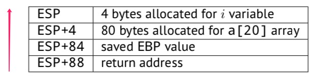
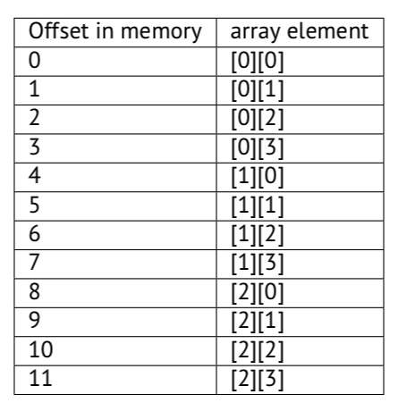
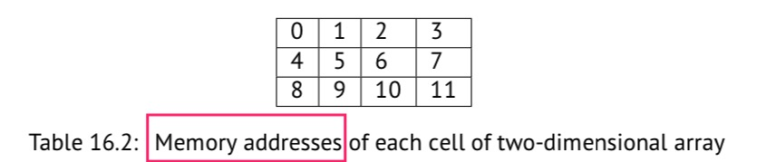
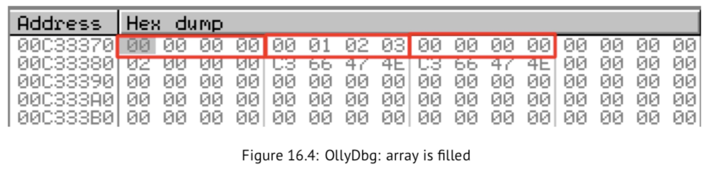
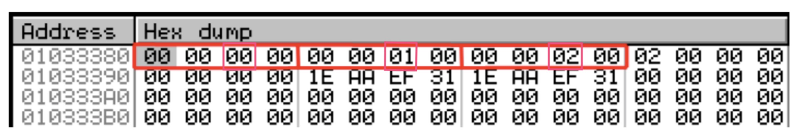
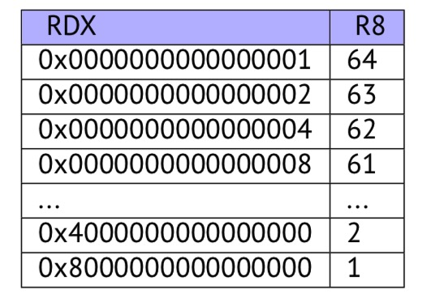
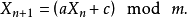
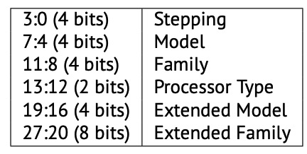
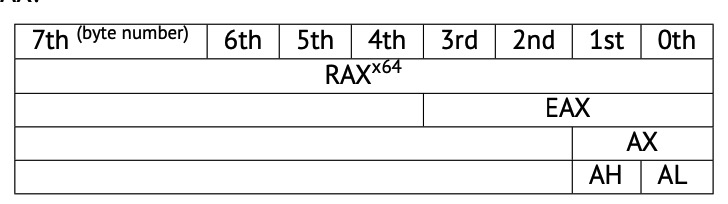
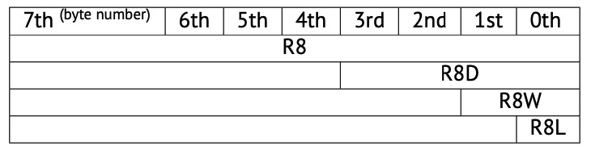

## RE4B-EN-LITE chapter16~21

## chapter 16 Arrays
- 数组（array）：内存中类型相同、位置相邻的一组变量

### 16.1 简单的例子
```c++
#include <stdio.h>
int main() 
{
    int a[20];
    int i;
    for (i=0; i<20; i++)
        a[i]=i*2;
    for (i=0; i<20; i++)
        printf ("a[%d]=%d\n", i, a[i]);
    return 0; 
};
```
- x86
    ```c
    _TEXT    SEGMENT
    _i$ = -84       ; size = 4
    _a$ = -80       ; size = 80  4字节*20=80字节
    _main      PROC
        push   ebp
        mov    ebp, esp
        sub    esp, 84      ; 00000054H
        mov    DWORD PTR _i$[ebp], 0
        jmp    SHORT $LN6@main
    $LN5@main:
        mov    eax, DWORD PTR _i$[ebp]
        add    eax, 1
        mov    DWORD PTR _i$[ebp], eax
    $LN6@main:
        cmp    DWORD PTR _i$[ebp], 20       ; 00000014H
        jge    SHORT $LN4@main
        mov    ecx, DWORD PTR _i$[ebp]
        shl    ecx, 1 ; 左移一位：i*2
        mov    edx, DWORD PTR _i$[ebp]  
        mov    DWORD PTR _a$[ebp+edx*4], ecx ; edx：i
        jmp    SHORT $LN5@main
    $LN4@main:
        mov    DWORD PTR _i$[ebp], 0
        jmp    SHORT $LN3@main
    $LN2@main:
        mov    eax, DWORD PTR _i$[ebp]
        add    eax, 1
        mov    DWORD PTR _i$[ebp], eax
        $LN3@main:
        cmp    DWORD PTR _i$[ebp], 20   ; 00000014H
        jge    SHORT $LN1@main
        mov    ecx, DWORD PTR _i$[ebp]
        mov    edx, DWORD PTR _a$[ebp+ecx*4]
        push   edx
        mov    eax, DWORD PTR _i$[ebp]
        push   eax
        push   OFFSET $SG2463
        call   _printf
        add    esp, 12      ; 0000000cH
        jmp    SHORT $LN2@main
    $LN1@main:
        xor    eax, eax
        mov    esp, ebp
        pop    ebp
        ret    0
    _main ENDP
    ```
    - 两个循环，第一个用来填充，第二个用来打印


### 16.2 缓冲区溢出
- 超出数组长度读取数据
    - c和c++中没有边界检查机制
    ```c++
    #include<stdio.h>
    int main() 
    {
        int a[20];
        int i;
        for (i=0; i<20; i++)
            a[i]=i*2;
        printf ("a[20]=%d\n", a[20]);
        return 0; 
    };
    ```
    - MSVC 2008 未优化
    ```c
    $SG2474 DB    'a[20]=%d', 0aH, 00H
    _i$ = -84 ; size = 4
    _a$ = -80 ; size = 80
    _main    PROC
        push   ebp
        mov    ebp, esp
        sub    esp, 84
        mov    DWORD PTR _i$[ebp], 0
        jmp    SHORT $LN3@main
    $LN2@main: ; i递增
        mov    eax, DWORD PTR _i$[ebp]
        add    eax, 1
        mov    DWORD PTR _i$[ebp], eax
    $LN3@main:
        cmp    DWORD PTR _i$[ebp], 20
        jge    SHORT $LN1@main
        mov    ecx, DWORD PTR _i$[ebp]
        shl    ecx, 1   ; 赋给的值递增i*2
        mov    edx, DWORD PTR _i$[ebp]
        mov    DWORD PTR _a$[ebp+edx*4], ecx ; 数组赋值
        jmp    SHORT $LN2@main
    $LN1@main:
        mov    eax, DWORD PTR _a$[ebp+80] ; 溢出
        push   eax
        push   OFFSET $SG2474 ; 'a[20]=%d'
        call   DWORD PTR __imp__printf
        add    esp, 8 ; 清两个push的栈
        xor    eax, eax
        mov    esp, ebp
        pop    ebp
        ret    0
    _main    ENDP
    _TEXT    ENDS
    END
    ```
- 超出数组长度写数据
    ```c++
    #include <stdio.h>
    int main() 
    {
        int a[20];
        int i;
        for (i=0; i<30; i++)
            a[i]=i;
        return 0; 
    };
    ```
    - MSVC
    ```c
    _TEXT    SEGMENT
    _i$ = -84 ; size = 4
    _a$ = -80 ; size = 80
    _main   PROC
        push   ebp
        mov    ebp, esp
        sub    esp, 84
        mov    DWORD PTR _i$[ebp], 0
        jmp    SHORT $LN3@main
    $LN2@main:
        mov    eax, DWORD PTR _i$[ebp]
        add    eax, 1
        mov    DWORD PTR _i$[ebp], eax
    $LN3@main:
        cmp    DWORD PTR _i$[ebp], 30 ; 0000001eH
        jge    SHORT $LN1@main
        mov    ecx, DWORD PTR _i$[ebp]
        mov    DWORD PTR _a$[ebp+ecx*4], ecx 
        jmp    SHORT $LN2@main
    $LN1@main:
        xor    eax, eax
        mov    esp, ebp
        pop    ebp
        ret    0
    _main ENDP
    ```
    - OD中动态调试，发现EBP的值变为0x14（十进制20），EIP的值变为0x15（十进制21），ECX、EDX的值变为0x1D（十进制29），显然不正确
    - 栈中布局
        
        - a[19]：栈中的最后一个数字位置
        - a[20]：覆盖了ESP+84（ebp）的位置
        - a[21]：ret执行 pop EIP，被覆盖的ESP+88的值返回个了EIP，导致EIP中的值变成0x15，内存地址为0x15处没有可执行代码，因此发生异常中断（栈溢出）
    - 创建一个长字符串故意并将其传递给程序，不检查该字符串的长度就将它复制到较短的缓冲区内，就可能实现程序任意跳转

### 16.3 One more word about arrays（数组相关补充）
```c++
void f(int size)
{
    int a[size];
    ...
};
```
- 上述初始化数组的方法是绝对不正确的，这是因为在编译阶段，编译器必须知道在本地堆栈布局中为它分配空间的确切大小。
- 如果要分配可变大小的数组，使用malloc初始化，别忘了使用完要垃圾回收
```c++
int *pi=new int[];               //指针pi所指向的数组未初始化
int *pi=new int[n];             //指针pi指向长度为n的数组，未初始化
int *pi=new int[]();            //指针pi所指向的地址初始化为0
delete [] pi;                   //回收pi所指向的数组
p=NULL;


int *p=(int *)malloc(100);                   //指向整型的指针p指向一个大小为100字节的内存的地址
int *p=(int *)malloc(25*sizeof(int)); //指向整型的指针p指向一个25个int整型空间的地址
int *p=(int *)malloc(int);
if(pi==NULL)
    printf("Out of memory!\n");
free (p);

void *calloc(size_t num_elements,size_t element_size);
void realloc(void *tr , size_t new_size);
malloc和calloc间的主要区别在于后者在返回指向内存的指针之前把它初始化为0。另一个区别是calloc的参数包括所需的元素的数量和每个元素的字节数。

realloc函数用于修改一个原先已经分配的内存块的大小。可以使一块内存扩大或缩小，如果扩大内存，则原来的内存块保持不变，在内存尾部增加新的内存块，切不进行初始化。如果缩小内存，则原来内存块从尾部进行删减。如果原先的内存块无法扩充，则新开辟一块内存，并复制原先的内存的内容，原先内存块失效无法再进行访问。
```

### 16.4 字符串指针数组
```c++
#include <stdio.h>
const char* month1[]=
{
        "January",
        "February",
        "March",
        "April",
        "May",
        "June",
        "July",
        "August",
        "September",
        "October",
        "November",
        "December"
};
// in 0..11 range
const char* get_month1 (int month)
{
    return month1[month];
};
```
- Optimizing MSVC 2013 x64
    ```c
    _DATA   SEGMENT
    month1  DQ      FLAT:$SG3122
            DQ      FLAT:$SG3123
            DQ      FLAT:$SG3124
            ...
            DQ      FLAT:$SG3133
    $SG3122 DB      'January', 00H
    $SG3123 DB      'February', 00H
    ...
    $SG3133 DB      'December', 00H
    _DATA   ENDS

    month$ = 8
    get_month1 PROC
            movsxd  rax, ecx
            lea     rcx, OFFSET FLAT:month1
            mov     rax, QWORD PTR [rcx+rax*8]
            ret     0
    get_month1 ENDP
    ```
    - MOVSXD：将一个32位的值从ECX(其中传递了month参数，为int类型)复制到具有符号扩展的RAX，使用符号扩展的原因是这个32位值将与其他64位值一起用于计算。因此，必须将其提升到64位。
    - lea rcx, OFFSET FLAT:month1：将指针数组的地址加载到RCX中，rcx是month1表的基址
    - mov rax, QWORD PTR [rcx+rax*8]： 输入值(month)乘以8并添加到地址中，在64位环境中，所有地址(或指针)都需要64位(或8字节)来存储，表中每个元素都是8字节宽，rax中存储着指向特定字符串的指针

- Optimizing GCC 4.9 x64
    ```c
    movsx   rdi, edi
    mov     rax, QWORD PTR month1[0+rdi*8]
    ret
    ```

- Optimizing MSVC 2013 x86
    ```c
    _month$ = 8
    _get_month1 PROC
            mov     eax, DWORD PTR _month$[esp-4] ; 参数赋给eax，不需要扩展了
            mov     eax, DWORD PTR _month1[eax*4]
            ret     0
    _get_month1 ENDP
    ```


### 16.5 多维数组
- 在内存中，多维数组也是线性存储，可以看成一维数组，但是内存地址需要按二维数组计算
    - 例如：3x4的二维数组
    
    
    - 内存地址计算
        - 行主序：首先将第一个索引乘以4(数组宽度)，然后加上第二个索引
            - c/c++和Python中都使用这种方法
        - 列主序：首先将第二个索引乘以3(数组高度)，然后加上第一个索引
            - 在FORTRAN、MATLAB和R中使用
    - 比较：就性能和缓存而言，数据组织的最佳方案是按照访问元素的顺序。因此，如果函数访问每一行的数据，则行主顺序更好，反之亦然。

- 二维数组的例子
    - 本例中使用char类型的数组，每个数组元素在内存中占一个字节。
    - 行填充的例子
        ```c++
        #include <stdio.h>
        char a[3][4];
        int main() 
        {
            int x, y;
            // clear array
            for (x=0; x<3; x++)
                for (y=0; y<4; y++)
                    a[x][y]=0;
            // fill second row by 0..3:
            for (y=0; y<4; y++)
                a[1][y]=y;
        };
        ```
        - 在内存中的分布
        

    - 列填充的例子
        ```c++
        #include <stdio.h>
        char a[3][4];
        int main() 
        {
            int x, y;
            // clear array
            for (x=0; x<3; x++)
                for (y=0; y<4; y++)
                    a[x][y]=0;
            // fill third column by 0..2:
            for (x=0; x<3; x++)
                a[x][2]=x;
        };
        ```
        - 在内存中的分布
        

- 用访问一维数组的方法访问二维数组
    - 至少有两种方法
    ```c++
    #include <stdio.h>
    char a[3][4];
    char get_by_coordinates1 (char array[3][4], int a, int b)
    {
        //二维数组
        return array[a][b];
    };
    char get_by_coordinates2 (char *array, int a, int b)
    {
        // 将array视为一维数组，数组宽度为4
        return array[a*4+b];
    };
    char get_by_coordinates3 (char *array, int a, int b)
    {
        // 将array视为指针，计算地址，取出地址中的内容
        return *(array+a*4+b);
    };
    int main()
    {
        a[2][3]=123;
        printf ("%d\n", get_by_coordinates1(a, 2, 3));
        printf ("%d\n", get_by_coordinates2(a, 2, 3));
        printf ("%d\n", get_by_coordinates3(a, 2, 3));
    };
    ```
    - Optimizing MSVC 2013 x64
        ```c++
        array$ = 8
        a$ = 16
        b$ = 24
        get_by_coordinates3 PROC
        ; RCX=address of array
        ; RDX=a
        ; R8=b
                movsxd  rax, r8d
        ; rax=b（列数）
                movsxd  r9, edx
        ; r9=a（行数）
                add     rax, rcx
        ; RAX=基地址（rcx）+列数（rax）
                movzx   eax, BYTE PTR [rax+r9*4]
        ; AL=基地址+行数*4+列数
                ret     0
        get_by_coordinates3 ENDP
        array$ = 8
        a$ = 16
        b$ = 24
        get_by_coordinates2 PROC
                movsxd  rax, r8d
                movsxd  r9, edx
                add     rax, rcx
                movzx   eax, BYTE PTR [rax+r9*4]
                ret     0
        get_by_coordinates2 ENDP
        array$ = 8
        a$ = 16
        b$ = 24
        get_by_coordinates1 PROC
                movsxd  rax, r8d
                movsxd  r9, edx
                add     rax, rcx
                movzx   eax, BYTE PTR [rax+r9*4]
                ret     0
        get_by_coordinates1 ENDP
        ```
        - 三种访问多维数组的方法反汇编相同
            
- 三维数组举例（每一项占4bytes=1字节）
    ```c
    #include <stdio.h>
    int a[10][20][30];
    void insert(int x, int y, int z, int value)
    {
        a[x][y][z]=value;
    };
    ```
    - MSVC 2010
    ```c
    _DATA SEGMENT
    COMM _a:DWORD:01770H _DATA ENDS
    PUBLIC _insert
    _TEXT SEGMENT
    _x$ = 8                     ;4bytes
    _y$=12                      ;4bytes
    _z$=16                      ;4bytes
    _value$ = 20
    _insert PROC
        push   ebp
        mov    ebp, esp
        mov    eax, DWORD PTR _x$[ebp] 
        imul   eax, 2400    ; eax=600*4*x
        mov    ecx, DWORD PTR _y$[ebp]
        imul   ecx, 120     ; ecx=30*4*y
        lea    edx, DWORD PTR _a[eax+ecx] ; edx=a+eax+ecx=a+600*4*x+30*4*y
        mov    eax, DWORD PTR _z$[ebp]
        ; eax=z
        mov    ecx, DWORD PTR _value$[ebp]
        ; ecx=value
        mov    DWORD PTR [edx+eax*4], ecx
        ; *(a+600*4*x+30*4*y+1*4*z)=value
        pop    ebp
        ret    0
    _insert    ENDP
    _TEXT      ENDS
    ```
    - GCC 4.4.1
    ```c
                    public insert
    insert          proc near
    x = dword ptr 8
    y = dword ptr  0Ch
    z = dword ptr  10h
    value = dword ptr  14h
                    push ebp
                    mov     ebp, esp
                    push    ebx
                    mov     ebx, [ebp+x] 
                ; ebx = x
                    mov     eax, [ebp+y]
                ; eax = y
                    mov     ecx, [ebp+z]
                ; ecx = z
                    lea     edx, [eax+eax]
                ; edx = y+y=2*y
                    mov     eax, edx
                ; eax = 2*y
                    shl     eax, 4
                ; eax = 2*y*16(二进制左移4位) = y*32
                    sub     eax, edx
                ; eax = y*30
                    imul    edx, ebx, 600
                ; edx = x*600
                    add     eax, edx
                ; eax = y*30+x*600
                    lea     edx, [eax+ecx]
                ; edx = y*30+x*600+z
                    mov     eax, [ebp+value]
                ; eax=value
                    mov     dword ptr ds:a[edx*4], eax  
                ; *(数组起始地址+edx*4bytes)=value
                    pop     ebx
                    pop     ebp
                    retn
    insert          endp
 
    ```
    - (y+y)≪4−(y+y)=(2y)≪4−2y=2⋅16⋅y−2y=32y−2y=30y ：没有使用乘法，只使用了一个加法，一个移位，一个减法实现，更快


### 16.6 结论
- 数组是内存中相邻的一组值，它适用于任何元素类型，包括结构体，通过计算对应地址访问数组中相应元素。


## Chapter 17 针对bit（比特、位）的运算
- 很多函数将字段中的某一位作为标志位输入，可以使用布尔值替代，但是开销会增大很多

### 17.1 特定位的检查
- x86 win32 API
```c
HANDLE fh;
fh=CreateFile("file", GENERIC_WRITE|GENERIC_READ, FILE_SHARE_READ, NULL, OPEN_ALWAYS, FILE_ATTRIBUTE_NORMAL, NULL);
```
- MSVC 2010
    ```c
    push    0
    push    128             ; 00000080H
    push    4
    push    0
    push    1
    push    -1073741824     ; c0000000H
    push    OFFSET $SG78813
    call    DWORD PTR __imp__CreateFileA@28
    mov     DWORD PTR _fh$[ebp], eax
    ```
    - WinNT.h
    ```c
    #define GENERIC_READ        (0x80000000L)
    #define GENERIC_WRITE       (0x40000000L)
    #define GENERIC_EXECUTE     (0x20000000L)
    #define GENERIC_ALL         (0x10000000L)
    ```
    - GENERIC_READ | GENERIC_WRITE = 0x80000000 | 0x40000000 = 0xC0000000：CreateFileA的第二个参数
    - CreateFile()是如何检查这些标志的【KERNEL32.DLL (Windows XP SP3 x86) CreateFileW】
        ```c
        test    byte ptr [ebp+dwDesiredAccess+3], 40h
        mov     [ebp+var_8], 1
        jz      short loc_7C83D417
        ; if ((dwDesiredAccess&0x40000000) == 0) goto loc_7C83D417
        jmp     loc_7C810817
        ```
        - TEST：没有对整个第二个参数进行判断，只判断了最关键的字节（ebp+dwDesiredAccess+3，检查是不是0x40（ GENERIC_WRITE ）），和AND指令操作类似但是不保留结果。TEST（AND）结果为0时，ZF置位，JZ跳转

### 17.2 设置和清除特定位
```c
#include <stdio.h>
#define IS_SET(flag, bit)   ((flag) & (bit))
#define SET_BIT(var, bit)   ((var) |= (bit))
#define REMOVE_BIT(var, bit)    ((var) &= ~(bit))
int f(int a) 
{
    int rt=a;
    SET_BIT (rt, 0x4000);
    REMOVE_BIT (rt, 0xfffffdff);
    return rt;
};
int main() 
{
    f(0x12340678);
};
```
- Non-optimizing MSVC
    ```c
    _rt$ = -4   ; size = 4
    _a$ = 8     ; size = 4
    _f  PROC    
        push   ebp
        mov    ebp, esp
        push   ecx
        mov    eax, DWORD PTR _a$[ebp]
        ; eax=a
        mov    DWORD PTR _rt$[ebp], eax
        ; rt=a
        mov    ecx, DWORD PTR _rt$[ebp]
        ; ecx=rt
        or     ecx, 16384                 ; 00004000H
        ; ecx=rt|100000000000000
        mov    DWORD PTR _rt$[ebp], ecx
        mov    edx, DWORD PTR _rt$[ebp]
        ; edx= rt|100000000000000
        and    edx, -513                  ; fffffdffH
        ; edx= (rt|100000000000000) & 0xfffffdffH
        mov    DWORD PTR _rt$[ebp], edx
        mov    eax, DWORD PTR _rt$[ebp]
        ; result= rt|100000000000000) & 0xfffffdffH
        mov    esp, ebp
        pop    ebp
        ret    0
    _f ENDP
    ```
    - OR：100000000000000为1的位的位数为14，做or操作将rt的第14位也置1
    - AND：11111111111111111111110111111111为0的位对应的位数为9，做and操作将rt第9位置0（也可以理解为只有第9位的数不进行原样拷贝，对应掩码该位置0）

- Optimizing MSVC
    ```c
    _a$ = 8     ; size = 4
    _f PROC
        mov     eax, DWORD PTR _a$[esp-4]
        and     eax, -513         ; fffffdffH
        or      eax, 16384        ; 00004000H
        ret    0
    _f ENDP
    ```

### 17.3 移位
- C、C++：<<、>>
- x86 ISA：SHL、SHR
- 移位操作使用场景：除或乘2时 or 将特定的位独立出来

### 17.4 计算所给数字的二进制中置为1的位的个数（population count）
- x86
```c
#include <stdio.h>
#define IS_SET(flag, bit)   ((flag) & (bit))
int f(unsigned int a)
{
    int i;
    int rt=0;
    for (i=0; i<32; i++)
        if(IS_SET(a,1 << i)) // 1从最低位开始匹配，一旦a的对应位置也是1，那么将会返回True，否则返回False
            rt++;
    return rt; 
};
int main() 
{
    f(0x12345678); // test
};
```
- i=0~31 1 << i= 1~0x80000000
- x86 MSVC
```c
_rt$ = -8   ;size=4 //局部变量
_i$ = -4     ;size=4 //局部变量
_a$ = 8      ;size=4 //参数
_f PROC
    push   ebp
    mov    ebp, esp
    sub    esp, 8
    mov    DWORD PTR _rt$[ebp], 0
    mov    DWORD PTR _i$[ebp], 0
    jmp    SHORT $LN4@f //开始循环
$LN3@f:
    mov    eax, DWORD PTR _i$[ebp]
    add    eax, 1
    mov    DWORD PTR _i$[ebp], eax ; i++
$LN4@f:
    cmp    DWORD PTR _i$[ebp], 32
    jge    SHORT $LN2@f ; i<32
    mov    edx, 1
    mov    ecx, DWORD PTR _i$[ebp] ; ecx：循环变量
    shl    edx, cl ; 1 << i,EDX=EDX<< CL(8位寄存器就够了：32=100000)
    and    edx, DWORD PTR _a$[ebp] ; IS_SET (a, 1 << i)
    je     SHORT $LN1@f ; ZF=1时跳转，即and的结果为0时跳转，即对应位置不是1
    mov    eax, DWORD PTR _rt$[ebp]  
    add     eax, 1
    mov    DWORD PTR _rt$[ebp], eax ; rt++
$LN1@f:
    jmp    SHORT $LN3@f
$LN2@f:
    mov    eax, DWORD PTR _rt$[ebp] ; 将返回值赋给eax
    mov    esp, ebp
    pop    ebp
    ret    0
_f ENDP
```

- x64
```c
#include <stdio.h>
#include <stdint.h>
#define IS_SET(flag, bit)   (flag) & (bit))
int f(uint64_t a)
{
    uint64_t i;
    int rt=0;
    for (i=0; i<64; i++)
        if (IS_SET (a, 1ULL<<i)) //unsigned long long [0,2^64-1]
            rt++;
    return rt;
};
```
- Optimizing MSVC 2010
```c
a$ = 8
f       PROC
; RCX = input value(rcx存放第一个参数)
        xor     eax, eax ; eax=0
        mov     edx, 1   ; edx=1
        lea     r8d, QWORD PTR [rax+64] (r8低32位=64)
; R8D=64
        npad    5 ; 用来确保下一条指令（从循环体开始）遵循16字节的内存对齐
$LL4@f:
        test    rdx, rcx ; 不改变寄存器的值
; there are no such bit in input value?
; skip the next INC instruction then.
        je      SHORT $LN3@f ; test 返回值为0跳转
        inc     eax     ; rt++
$LN3@f:
        rol     rdx, 1  ; RDX=RDX<<1 （=x86:SHL）
        dec     r8      ; R8-- r8=64～0
        jne     SHORT $LL4@f
        fatret  0
f ENDP
```


- Optimizing MSVC 2012
    ```c
    a$ = 8
    f       PROC
    ; RCX = input value
            xor     eax, eax
            mov     edx, 1 ; 存放第二个参数
            lea     r8d, QWORD PTR [rax+32]
    ; EDX = 1, R8D = 32
            npad    5
    $LL4@f:
    ; pass 1 ------------------------------------
            test    rdx, rcx
            je      SHORT $LN3@f
            inc     eax     ; rt++
    $LN3@f:
            rol     rdx, 1  ; RDX=RDX<<1
    ; -------------------------------------------
    ; pass 2 ------------------------------------
            test    rdx, rcx
            je      SHORT $LN11@f
            inc     eax     ; rt++
    $LN11@f:
            rol     rdx, 1  ; RDX=RDX<<1
    ; -------------------------------------------
            dec     r8      ; R8--
            jne     SHORT $LL4@f
            fatret  0
    f       ENDP
    ```
    - 一个循环里判断两位，共循环32次
    - weird and illogical, but perfectly working

### 17.5 结论
- 常用移位指令
    - x86_unsigned values:SHR、SHL
    - x86_signed values:SAR、SHL
    - ARM_unsigned：LSR/LSL
    - ARM_signed values:ASR/LSL
- 检查特定的位(在编译阶段已知的情况）
    - if (input&0x40)
    ```c
    TEST REG, 40h
    JNZ is_set
    ; bit is not set

    TEST REG, 40h
    JZ is_cleared
    ; bit is set
    ```
    - 有时候用and替换test

- 检查特定的位(在运行时已知的情况）
    - if ((value>>n)&1) //右移n位然后取最低位的bit
    ```c
    ; REG=input_value
    ; CL=n
    SHR REG, CL
    AND REG, 1
    ```
    - if (value & (1<<n))//将1右移n位，检查value对应的位是否非0
    ```c
    ; CL=n
    MOV REG, 1
    SHL REG, CL
    AND input_value, REG
    ```
- 设置特定的位(在编译时已知的情况）
    - value=value|0x40;
    ```c
    OR REG, 40h
    ```
- 设置特定的位(在运行时已知的情况）
    - value=value|(1<<n);
    ```c
    ; CL=n
    MOV REG, 1
    SHL REG, CL
    OR input_value, REG
    ```
- 清除特定的位(在编译时已知的情况）
    - value=value&(~0x40); //清除value中对应0x40为1的那一位
    ```c
    AND REG, 0FFFFFFBFh ;x86

    AND REG, 0FFFFFFFFFFFFFFBFh ;x64
    ```
-  清除特定的位(在运行时已知的情况）
    - value=value&(~(1<<n));
    ```c
    ; CL=n
    MOV REG, 1
    SHL REG, CL
    NOT REG
    AND input_value, REG
    ```


## Chapter 18 作为伪随机数发生器的线性同余发生器
- 线性同余发生器可能是生成随机数最简单的方法，虽然在现在它已经不再流行
- 基本思想：通过对前一个数进行线性运算并取模从而得到下一个数

    ```c
    #include <stdint.h>
    #define RNG_a 1664525
    #define RNG_c 1013904223
    static uint32_t rand_state;
    void my_srand (uint32_t init) //种子，初始化内部状态
    {
        rand_state=init;
    }
    int my_rand ()//使用三个运算生成伪随机数（* + &）
    {
        rand_state=rand_state*RNG_a;
        rand_state=rand_state+RNG_c;
        return rand_state & 0x7fff;
    }
    ```
    - C/C++宏（macro）和常量（constant）的区别：预处理器会将宏替换成对应的值，不占用内存；常量是一个只读的向量，可以通过地址访问它
    

### 18.1 x86
- Optimizing MSVC 2013
    ```c
    _BSS    SEGMENT
    _rand_state DD  01H DUP (?)
    _BSS    ENDS

    _init$ = 8
    _srand  PROC
            mov     eax, DWORD PTR _init$[esp-4]
            mov     DWORD PTR _rand_state, eax
            ret     0
    _srand  ENDP

    _TEXT   SEGMENT
    _rand   PROC
            imul    eax, DWORD PTR _rand_state, 1664525 ; eax=_rand_state*1664525
            add     eax, 1013904223         ; 3c6ef35fH
            mov     DWORD PTR _rand_state, eax
            and     eax, 32767              ; 00007fffH
            ret     0
    _rand   ENDP
    _TEXT   ENDS
    ```
    - 没有给宏分配内存

-  Non-optimizing MSVC 2013
```c
_BSS    SEGMENT
_rand_state DD  01H DUP (?)
_BSS    ENDS
_init$ = 8
_srand  PROC
        push    ebp
        mov     ebp, esp
        mov     eax, DWORD PTR _init$[ebp]
        mov     DWORD PTR _rand_state, eax
        pop     ebp
        ret     0
_srand ENDP
_TEXT   SEGMENT
_rand   PROC
        push    ebp
        mov     ebp, esp
        imul    eax, DWORD PTR _rand_state, 1664525
        mov     DWORD PTR _rand_state, eax
        mov     ecx, DWORD PTR _rand_state
        add     ecx, 1013904223 ; 3c6ef35fH
        mov     DWORD PTR _rand_state, ecx
        mov     eax, DWORD PTR _rand_state
        and     eax, 32767      ; 00007fffH
        pop     ebp
        ret     0
_rand   ENDP
_TEXT   ENDS
```

### 18.2 x64
- x64仍然使用32位寄存器，因为处理的类型为int（4字节），变化是输入的参数来自ecx寄存器而不是堆栈
- Optimizing MSVC 2013 x64
```c
_BSS    SEGMENT
rand_state DD   01H DUP (?)
_BSS    ENDS
init$ = 8
my_srand PROC
; ECX = input argument
        mov     DWORD PTR rand_state, ecx
        ret     0
my_srand ENDP

_TEXT   SEGMENT
my_rand PROC
        imul    eax, DWORD PTR rand_state, 1664525
        add     eax, 1013904223
        mov     DWORD PTR rand_state, eax
        and     eax, 32767
        ret     0
my_rand ENDP
_TEXT ENDS
```


## Chapter 19 结构体
- C\C++体系结构中，不管什么类型的变量总是一起存储在内存中

### 19.1 MSVC：以SYSTEMTIM为例
```c++
typedef struct _SYSTEMTIME { 
    WORD wYear;
    WORD wMonth;
    WORD wDayOfWeek;
    WORD wDay;
    WORD wHour;
    WORD wMinute;
    WORD wSecond;
    WORD wMilliseconds;
} SYSTEMTIME, *PSYSTEMTIME;
```
- 获得当前时间
```c++
#include<windows.h>
#include<stdio.h>

void main()
{
    SYSTEMTIME t;
    GetSystemTime(&t);
    printf("%04d-%02d-%02d %02d:%02d:%02d\n",t.wYear,t.wMonth,t.wDay,t.wHour,t.wMinute,t.wSecond);
    return;
}
- MSVC 2010 /GS-(编译选项，取消缓冲区溢出检测)
```c
_t$ = -16 ; size = 16 
_main PROC
    push ebp
    mov ebp, esp
    ;在栈上为这个结构体分配了16bytes的空间，sizeof(WORD)*8，1个WORD 16bit，两个字节，8个WORD加起来一共16个字节
    sub esp, 16 
    ;构造函数参数
    lea eax, DWORD PTR _t$[ebp]
    push eax
    call DWORD PTR __imp__GetSystemTime@4
    ;构造函数参数
    movzx ecx, WORD PTR _t$[ebp+12] ; wSecond
    push ecx
    movzx edx, WORD PTR _t$[ebp+10] ; wMinute
    push edx
    movzx eax, WORD PTR _t$[ebp+8] ; wHour
    push eax
    movzx ecx, WORD PTR _t$[ebp+6] ; wDay
    push ecx
    movzx edx, WORD PTR _t$[ebp+2] ; wMonth
    push edx
    movzx eax, WORD PTR _t$[ebp] ; wYear
    push eax
    push OFFSET $SG78811 ; '%04d-%02d-%02d %02d:%02d:%02d', 0aH, 00H 
    call _printf
    ; 清栈
    add esp, 28
    xor eax, eax
    mov esp, ebp
    pop ebp
    ret 0
_main ENDP
```
    - GetSystemTime(&t);：t指向的是SYSTEMTIME结构体的第一项`wYear`的地址，同时也是结构体的首地址
    - 结构体中的每一项占两个字节，栈中一项是一个字节，8bit

- 将结构体用数组代替
    - 结构体其实就是参数在内存中并排排列，尝试用数组重写SYSTEMTIME
    ```c++
    #include <windows.h> 
    #include <stdio.h>
    void main() 
    {
        WORD array[8];
        GetSystemTime(array);
        printf ("%04d-%02d-%02d %02d:%02d:%02d\n",
        array[0] /* wYear */, array[1] /* wMonth */, array[3] /* wDay */, array[4] /* wHour */, array[5] /* wMinute */, array[6] /* wSecond */);
        return; 
    };
    ```
    - Non-optimizing MSVC 2010
    ```c++
    $SG78573 DB '%04d-%02d-%02d %02d:%02d:%02d', 0aH, 00H

    _array$ = -16 ; size = 16 
    _main PROC
        push ebp
        mov ebp, esp 
        sub esp, 16

        lea eax, DWORD PTR _array$[ebp]
        push eax
        call DWORD PTR __imp__GetSystemTime@4
        
        movzx ecx, WORD PTR _array$[ebp+12] ; wSecond push ecx
        movzx edx, WORD PTR _array$[ebp+10] ; wMinute push edx
        movzx eax, WORD PTR _array$[ebp+8] ; wHoure push eax
        movzx ecx, WORD PTR _array$[ebp+6] ; wDay push ecx
        movzx edx, WORD PTR _array$[ebp+2] ; wMonth push edx
        movzx eax, WORD PTR _array$[ebp] ;
        wYear push eax
        push OFFSET $SG78573
        call _printf
        add esp, 28 
        xor eax, eax 
        mov esp, ebp 
        pop ebp
        ret 0 
    _main ENDP
    ```
    - 和结构体效果是一样的，但是一般不会这么做（数组每一项含义应该最好相同），结构体易于扩展

### 19.2 使用malloc()给结构体分配空间

- 通常将结构体放在堆上更合适
```c++
#include <windows.h> 
#include <stdio.h>
void main() 
{
    SYSTEMTIME *t;
    t=(SYSTEMTIME *)malloc(sizeof(SYSTEMTIME)); GetSystemTime(t);
    printf("%04d-%02d-%02d %02d:%02d:%02d\n", t->wYear, t->wMonth, t->wDay, t->wHour, t->wMinute, t->wSecond);
    free(t);
    return; 
};
```
    - sizeof(SYSTEMTIME)：16字节
- Optimizing MSVC /0x(最佳优化)
```c++
_main PROC 
    push esi 
    push 16
    call _malloc ;指向分配地址的指针存在eax中

    add esp, 4
    mov esi, eax ;分配的地址指针给esi
    
    ; 函数调用
    push esi
    call DWORD PTR __imp__GetSystemTime@4 
    
    movzx eax, WORD PTR [esi+12] ; wSecond
    movzx ecx, WORD PTR [esi+10] ; wMinute movzx edx, WORD PTR [esi+8] ; wHour 
    push eax
    movzx eax, WORD PTR [esi+6] ; wDay 
    push ecx
    movzx ecx, WORD PTR [esi+2] ; wMonth 
    push edx
    movzx edx, WORD PTR [esi] ; wYear 
    push eax
    push ecx
    push edx
    push OFFSET $SG78833 
    call _printf

    push esi ;将指针清空，释放内存地址
    call _free

    add esp, 32
    xor eax, eax
    pop esi
    ret 0
_main ENDP
```
    - movzx（Move with Zero eXtend）：和movsx类似，两者的区别是MOVSX先符号扩展（用符号位补齐剩余位数）再传送，MOVZX先零扩展（用0补齐剩余位数）再传送。这里printf()需要32bit的参数，但是WORD只有16bit，因此通过int(32bit)类型转换一下，movzx将高16bit清零，防止之前存在垃圾信息

- 将结构体用数组表示，在堆上分配内存
```c++
#include <windows.h> 
#include <stdio.h>
void main() {
    WORD *t;
    t=(WORD *)malloc (16); 
    GetSystemTime (t);
    printf ("%04d-%02d-%02d %02d:%02d:%02d\n",
    t[0] /* wYear */, t[1] /* wMonth */, t[3] /* wDay */,t[4] /* wHour */, t[5] /* wMinute */, t[6] /* wSecond */);
    free (t);
    return; 
};
```

- Optimizing MSVC
```c
$SG78594 DB '%04d-%02d-%02d %02d:%02d:%02d', 0aH, 00H
_main PROC
    push esi
    push 16
    call _malloc 

    add esp, 4 
    mov esi, eax 
    push esi
    call DWORD PTR __imp__GetSystemTime@4

    movzx eax, WORD PTR [esi+12]
    movzx ecx, WORD PTR [esi+10]
    movzx edx, WORD PTR [esi+8]
    push   eax
    movzx eax, WORD PTR [esi+6] push ecx
    movzx ecx, WORD PTR [esi+2] push edx
    movzx edx, WORD PTR [esi] push eax
    push ecx
    push edx
    push OFFSET $SG78594 
    call _printf

    push esi
    call _free
    add esp, 32 
    xor eax, 
    eax pop esi
    ret 0
_main ENDP
```
    - 和结构体相同

### 19.3 填充结构体
- example
```c++
#include <stdio.h>
struct s {
    char a;
    int b;
    char c;
    int d;
};
void f(struct s s)
{
    printf ("a=%d; b=%d; c=%d; d=%d\n", s.a, s.b, s.c, s.d); 
};
int main() 
{
    struct s tmp;
    tmp.a=1; 
    tmp.b=2; 
    tmp.c=3; 
    tmp.d=4; 
    f(tmp);
};
    - char: 1byte
    - int: 4bytes

- x86:MSVC 2012 /GS- /Ob0(禁用内联展开)
```c++
_tmp$ = -16 
_main PROC
    push ebp
    mov ebp, esp 
    sub esp, 16
    mov BYTE PTR _tmp$[ebp], 1 ;set field a 
    mov DWORD PTR _tmp$[ebp+4], 2 ;set field b
    mov BYTE PTR _tmp$[ebp+8], 3 ;set field c
    mov DWORD PTR _tmp$[ebp+12], 4 ;set field d 
    sub esp, 16 ;又分配了一段空间给复制的结构体
    mov eax, esp
    ; 复制结构体
    mov ecx, DWORD PTR _tmp$[ebp] ；a
    mov DWORD PTR [eax], ecx
    mov edx, DWORD PTR _tmp$[ebp+4] ；b
    mov DWORD PTR [eax+4], edx
    mov ecx, DWORD PTR _tmp$[ebp+8] ；c
    mov DWORD PTR [eax+8], ecx
    mov edx, DWORD PTR _tmp$[ebp+12] ；d
    mov DWORD PTR [eax+12], edx 
    call _f

    add esp, 16 
    xor eax, eax 
    mov esp, ebp 
    pop ebp
    ret 0 
_main ENDP

_s$ = 8 ; size = 16 
?f@@YAXUs@@@Z PROC ; f
    push ebp
    mov ebp, esp ; [esp]存储的是复制的结构体的起始
    mov eax, DWORD PTR _s$[ebp+12] 
    push eax
    movsx ecx, BYTE PTR _s$[ebp+8] 
    push ecx
    mov edx, DWORD PTR _s$[ebp+4] 
    push edx
    movsx eax, BYTE PTR _s$[ebp] 
    push eax
    push OFFSET $SG3842
    call _printf

    add esp, 20
    pop ebp
    ret 0
    ?f@@YAXUs@@@Z ENDP ; 

f _TEXT ENDS
```
    - 复制结构体的原因：不确定f()函数是否会修改它(做深拷贝)
    - 如果传递给f()的是指针则不会进行拷贝（？？因为是地址）
    - 给结构体中所有元素都分配了4字节的地址空间

- MSVC 2012 /GS- /Zp1（/Zp[n] pack structures on n-byte boundary）1byte对齐边界
```c++
_main PROC 
    push ebp
    mov ebp, esp
    sub esp, 12
    mov BYTE PTR _tmp$[ebp], 1
    mov DWORD PTR _tmp$[ebp+1], 2 
    mov BYTE PTR _tmp$[ebp+5], 3 
    mov DWORD PTR _tmp$[ebp+6], 4 

    ；复制过程
    sub esp, 12
    mov eax, esp

    mov ecx, DWORD PTR _tmp$[ebp] 
    mov DWORD PTR [eax], ecx
    mov edx, DWORD PTR _tmp$[ebp+4] 
    mov DWORD PTR [eax+4], edx
    mov cx, WORD PTR _tmp$[ebp+8]
    mov WORD PTR [eax+8], cx

    call _f

    add esp, 12 
    xor eax, eax 
    mov esp, ebp 
    pop ebp
    ret 0 
_main ENDP

_TEXT SEGMENT _s$ = 8 ; size = 10 
?f@@YAXUs@@@Z PROC    ; f
    push ebp
    mov ebp, esp
    mov eax, DWORD PTR _s$[ebp+6] 
    push eax
    movsx ecx, BYTE PTR _s$[ebp+5] 
    push ecx
    mov edx, DWORD PTR _s$[ebp+1] 
    push edx
    movsx eax, BYTE PTR _s$[ebp] 
    push eax
    push OFFSET $SG3842
    call _printf
    add esp, 20
    pop ebp
    ret 0
?f@@YAXUs@@@Z ENDP    ; f
```
    - 优化后只需要分配正好的10个byte的空间：char-1 byte，int-4 byte。
        - 优点：节省空间
        - 缺点：降低了CPU访问速度
    - 为什么复制过程只用了三对mov：分别复制4bytes+4bytes+2bytes，编译器决定（better than 4+1+4+1）
    - 如果在许多源文件和目标文件中使用该结构，那么所有这些文件都必须按照关于结构打包的相同约定（比如对齐）进行编译。除了设置如何对齐每个结构字段的MSVC /Zp选项外，还可以使用#pragma pack(n)【主要作用就是改变编译器的内存对齐方式】编译器选项，在MSVC和GCC中都可用。
    > #pragma pack(1):强制按照1字节进行对齐，可以理解成所有的内容都是按照1字节进行读取，其他所有的数据成员都是1字节的整数倍，所以也就不用进行内存对齐，各个成员在内存中就按照实际顺序进行排列，结构体实际长度为10
    - [其他参考](https://www.jianshu.com/p/d994731f658d)

- #pragma pack(n)编译器是怎么做到的
    - WinNT.h文件中
        - #include "pshpack1.h"：实现1字节对齐
        - #include "pshpack4.h"：实现4字节对齐
        - 1， 2， 4， 8， 16
    - PshPack1.h中
    ```c++
    #if ! (defined(lint) || defined(RC_INVOKED))
    #if ( _MSC_VER >= 800 && !defined(_M_I86)) || defined(_PUSHPOP_SUPPORTED) 
    #pragma warning(disable:4103)
    #if !(defined( MIDL_PASS )) || defined( __midl )
    #pragma pack(push,1)
    #else
    #pragma pack(1)
    #endif
    #else
    #pragma pack(1)
    #endif
    #endif /* ! (defined(lint) || defined(RC_INVOKED)) */
    ```
- 补充：将结构体传递给函数时，和单独将结构体中的每个元素传递给函数是相同的

### 19.4 嵌套结构体
```c++
#include <stdio.h>
struct inner_struct {
    int a;
    int b; 
};
struct outer_struct {
    char a;
    int b;
    struct inner_struct c; 
    char d;
    int e;
};
void f(struct outer_struct s) {
    printf ("a=%d; b=%d; c.a=%d; c.b=%d; d=%d; e=%d\n", s.a, s.b, s.c.a, s.c.b, s.d, s.e);
};
int main() {
    struct outer_struct s; 
    s.a=1;
    s.b=2;
    s.c.a=100;
    s.c.b=101; 
    s.d=3; 
    s.e=4; 
    f(s);
};
```
-  Optimizing MSVC 2010 /Ob0
```c
$SG2802 DB 'a=%d; b=%d; c.a=%d; c.b=%d; d=%d; e=%d', 0aH, 00H 
_TEXT SEGMENT
_s$ = 8 
_f PROC
    mov eax, DWORD PTR _s$[esp+16] 
    movsx ecx, BYTE PTR _s$[esp+12] 
    mov edx, DWORD PTR _s$[esp+8] 
    push eax ; 修改了栈中的个数
    mov eax, DWORD PTR _s$[esp+8]  
    push ecx
    mov ecx, DWORD PTR _s$[esp+8] 
    push edx
    movsx edx, BYTE PTR _s$[esp+8] 
    push eax
    push ecx
    push edx
    push OFFSET $SG2802 ; 'a=%d; b=%d; c.a=%d; c.b=%d; d=%d; e=%d' 
    call _printf
    add esp, 28
    ret 0
_f ENDP

_s$ = -24 
_main PROC
    sub esp, 24 ; 4byte x 6 = 24byte
    push ebx
    push esi
    push edi
    mov ecx, 2
    sub esp, 24
    mov eax, esp
    mov BYTE PTR _s$[esp+60], 1 
    mov ebx, DWORD PTR _s$[esp+60] 
    mov DWORD PTR [eax], ebx        ;s.a=1
    mov DWORD PTR [eax+4], ecx      ;s.b=2
    lea edx, DWORD PTR [ecx+98]     ;2+98=100
    lea esi, DWORD PTR [ecx+99]     ;2+99=101
    lea edi, DWORD PTR [ecx+2]      ;2+2=4
    mov DWORD PTR [eax+8], edx      ;s.c.a=100
    mov BYTE PTR _s$[esp+76], 3     
    mov ecx, DWORD PTR _s$[esp+76]  
    mov DWORD PTR [eax+12], esi     ;s.c.b=101
    mov DWORD PTR [eax+16], ecx     ;s.d=3
    mov DWORD PTR [eax+20], edi     ;s.e=4
    call _f

    add esp, 24 
    pop edi
    pop esi
    xor eax, eax 
    pop ebx
    add esp, 24
    ret 0 
_main ENDP
```
- 从汇编代码中看不出嵌套结构体中另一个结构体的样式，嵌套结构展开为了线性或一维结构。
- question：如何解释f中栈的变化？？？

### 19.5 结构体中的位字段
- CPUID example
    - c/c++中允许定义每个结构体字段中的准确的位数，这有利于节省内存空间，比如对于bool类型的变量来说只需要占1bit。（当然这样降低了CPU访问的速度）
    - 以CPUID指令为例。这条指令返回关于当前CPU及其特性的信息
    - 执行这条指令后，将返回结果存储到eax寄存器，eax0～27位的结果表示如下：
    
    - MSVC 2010有CPUID宏，但是GCC 4.4.1没有。因此，让我们在GCC的内置汇编器的帮助下来手工创建这个函数。
    ```c++
    #include <stdio.h>

    #ifdef __GNUC__
    static inline void cpuid(int code, int *a, int *b, int *c, int *d) {
        asm volatile("cpuid":"=a"(*a),"=b"(*b),"=c"(*c),"=d"(*d):"a"(code)); 
    }
    #endif

    #ifdef _MSC_VER 
    #include <intrin.h> 
    #endif

    struct CPUID_1_EAX 
    {
        unsigned int stepping:4; //定义所占位数
        unsigned int model:4;
        unsigned int family_id:4; 
        unsigned int processor_type:2; unsigned int reserved1:2; 
        unsigned int extended_model_id:4; unsigned int extended_family_id:8; unsigned int reserved2:4;
        //28+4=32，正好存在eax寄存器中
    };
    int main() 
    {
        struct CPUID_1_EAX *tmp; 
        int b[4];
    #ifdef _MSC_VER 
        __cpuid(b,1);
    #endif
    #ifdef __GNUC__
        cpuid (1, &b[0], &b[1], &b[2], &b[3]);
    #endif
        tmp=(struct CPUID_1_EAX *)&b[0]; //强制类型转换！！
        printf ("stepping=%d\n", tmp->stepping);
        printf ("model=%d\n", tmp->model);
        printf ("family_id=%d\n", tmp->family_id);
        printf ("processor_type=%d\n", tmp->processor_type);
        printf ("extended_model_id=%d\n", tmp->extended_model_id); printf ("extended_family_id=%d\n", tmp->extended_family_id);

        return 0; 
    };
    ```
    - 当CPUID填充EAX/EBX/ECX/EDX之后，这些寄存器的值将被写入b[]数组中。用结构体CPUID_1_EAX类型解析b[0]中的内容（按照相应bit数），tmp指向返回结果的首地址。

    - Optimizing MSVC 2008
    ```c++
    _b$=-16 ;size=16 
    _main PROC
        sub esp, 16 
        
        push ebx
        xor ecx, ecx 
        mov eax, 1 
        cpuid ; MSVC中直接执行该条指令
        
        ;（EAX/EBX/ECX/EDX被填充）
        push esi
        lea esi, DWORD PTR _b$[esp+24] 
        mov DWORD PTR [esi], eax ; 4个字节 32bits
        mov DWORD PTR [esi+4], ebx 
        mov DWORD PTR [esi+8], ecx 
        mov DWORD PTR [esi+12], edx

        mov esi, DWORD PTR _b$[esp+24] 
        mov eax, esi ; EAX中的保存的值是需要的信息
        and eax, 15 ; (15=1111)提取出(0~3位)，代表Stepping
        push eax
        push OFFSET $SG15435 ; 'stepping=%d', 0aH, 00H 
        call _printf

        mov ecx, esi
        shr ecx, 4 ; 提取出(4~7位)，代表Model
        and ecx, 15 
        push ecx
        push OFFSET $SG15436 ; 'model=%d', 0aH, 00H 
        call _printf

        mov edx, esi
        shr edx, 8 ; 提取出(8~11位)，代表Family
        and edx, 15
        push edx
        push OFFSET $SG15437 ; 'family_id=%d', 0aH, 00H 
        call _printf

        mov eax, esi
        shr eax, 12 ; 提取出(12~13位)，代表Processor Type
        and eax, 3 ;3=111
        push eax
        push OFFSET $SG15438 ; 'processor_type=%d', 0aH, 00H 
        call _printf

        mov ecx, esi
        shr ecx, 16 ; 提取出(16~19位)，代表Extended Model
        and ecx, 15 
        push ecx
        push OFFSET $SG15439 ; 'extended_model_id=%d', 0aH, 00H 
        call _printf

        shr esi, 20 ;提取出(20~27位)，代表Extended Family
        and esi, 255 ;255=11111111
        push esi
        push OFFSET $SG15440 ; 'extended_family_id=%d', 0aH, 00H 
        call _printf

        add esp, 48 pop esi
        xor eax, eax pop ebx
        add esp, 16
        ret 0 
    _main ENDP
    ```
    - SHR指令：EAX中值移位，代表跳过了这些位
    - AND指令：清除左边不需要的位，换句话说只在EAX寄存器中留下我们需要的那些位。


## Chapter 20 64bit的值在32bit的环境下

### 20.1 返回64位的值
```c++
#include <stdint.h>
uint64_t f ()
{
    return 0x1234567890ABCDEF; //16*4=64bit
};
```
- x86-Optimizing MSVC 2010
    - 在32位环境下，64位的返回值通过EDX:EAX寄存器对返回给调用函数
    ```c++
    _f PROC
        mov eax, -1867788817 ; 90abcdefH 
        mov edx, 305419896 ; 12345678H 
        ret 0
    _f ENDP
    ```

### 20.2 参数传递、加法、减法
```c++
#include <stdint.h>
uint64_t f_add (uint64_t a, uint64_t b) 
{
    return a+b;
};
void f_add_test () 
{
#ifdef __GNUC__
    printf ("%lld\n", f_add(19428925302874, 19726088895461)); 
#else
    printf ("%I64d\n", f_add(19428925302874, 19726088895461)); 
#endif
};
uint64_t f_sub (uint64_t a, uint64_t b) 
{
    return a-b;
};
```
- x86 Optimizing MSVC 2012 /Ob1(inline展开)
```c++
_a$ = 8 ;size=8 
_b$ = 16 ;size=8 
_f_add PROC
    ; 低32bit运算
    mov eax, DWORD PTR _a$[esp-4]
    add eax, DWORD PTR _b$[esp-4]
    ; 高32bit运算
    mov edx, DWORD PTR _a$[esp]
    adc edx, DWORD PTR _b$[esp]
    ret 0
_f_add ENDP

; 每个64bit的值用两个32bit的值代替，首先是高32位然后是低32位(高32位填充满了剩下的再去填充低32位)

_f_add_test PROC 
    push 5461           ; 00001555H
    push 1972608889     ; 75939f79H
    push 2874           ; 00000b3aH
    push 1942892530     ; 73ce2ff_subH
    call _f_add 
                      
    push edx
    push eax
    push OFFSET $SG1436 ; '%I64d', 0aH, 00H call _printf
    add esp, 28
    ret 0
_f_add_test ENDP

_f_sub PROC
    mov eax, DWORD PTR _a$[esp-4] 
    sub eax, DWORD PTR _b$[esp-4] 
    mov edx, DWORD PTR _a$[esp] 
    sbb edx, DWORD PTR _b$[esp] 
    ret 0
_f_sub ENDP
```
    - 加法运算时，低32位的部分先运算，如果有进位CF标志位置1，ADC指令代表将高32bit相加然后再加上CF的值
    - 减法运算时，如果低32位运算有借位，CF标志位置1，SBB指令会检查CF的值，CF为1时高位做减法会减去1

### 20.3 乘法、除法
```c++
#include <stdint.h>
uint64_t f_mul (uint64_t a, uint64_t b) 
{
    return a*b;
};
uint64_t f_div (uint64_t a, uint64_t b) 
{
    return a/b;
};
uint64_t f_rem (uint64_t a, uint64_t b) 
{
    return a % b;
};
- x86 Optimizing MSVC 2013 /Ob1
```c++
_a$ = 8 ; size = 8 
_b$ = 16 ; size = 8
_f_mul  PROC
        push ebp
        mov ebp, esp
        mov eax, DWORD PTR _b$[ebp+4]
        push eax
        mov ecx, DWORD PTR _b$[ebp]
        push ecx
        mov edx, DWORD PTR _a$[ebp+4]
        push edx
        mov eax, DWORD PTR _a$[ebp]
        push eax
        call __allmul ; long long multiplication pop ebp
        ret 0
_f_mul ENDP

_a$ = 8 ; size = 8 
_b$ = 16 ; size = 8
_f_div
PROC
        push ebp
        mov ebp, esp
        mov eax, DWORD PTR _b$[ebp+4] 第二个乘数低32bit 
        push eax
        mov ecx, DWORD PTR _b$[ebp] ;第二个乘数高32bit
        push ecx
        mov edx, DWORD PTR _a$[ebp+4];第一个乘数低32bit 
        push edx
        mov eax, DWORD PTR _a$[ebp] ;第一个乘数高32bit
        push eax
        call __aulldiv ; unsigned long long division
        pop ebp
        ret 0
_f_div ENDP

_a$ = 8   ; size = 8
_b$ = 16 ; size = 8 
_f_rem PROC
        push ebp
        mov ebp, esp
        mov eax, DWORD PTR _b$[ebp+4] 
        push eax
        mov ecx, DWORD PTR _b$[ebp] 
        push ecx
        mov edx, DWORD PTR _a$[ebp+4] 
        push edx
        mov eax, DWORD PTR _a$[ebp] 
        push eax
        call __aullrem ; unsigned long pop ebp
        ret 0
_f_rem ENDP
```
- 因为乘除的实现比较复杂，编译器通常将调用封装成库函数
- LONGLONG _allmul(LONGLONG a,LONGLONG b)
DESCRIP

### 20.4 右移操作
```c++
#include <stdint.h>
uint64_t f (uint64_t a) 
{
    return a>>7;
};
```
- x86 Optimizing MSVC 2012 /Ob1
```C++
_a$ = 8     ; size = 8
_f PROC
    mov eax, DWORD PTR _a$[esp-4]  ;低32bit
    mov edx, DWORD PTR _a$[esp] ;高32bit
    shrd eax, edx, 7
    shr edx, 7
    ret 0 
_f ENDP
```
- 先进行低32bit移位，再进行高32bit移位，低32位使用`指令shrd`辅助
    > SHLD/SHRD  Reg/Mem, Reg, CL/Imm ;80386+
    其中：第一操作数是一个16位/32位的寄存器或存储单元；第二操作数(与前者具有相同位数)一定是寄存器；第三操作数是移动的位数，它可由CL或一个立即数来确定。
    在执行SHLD指令时，第一操作数向左移n位，其“空出”的低位由第二操作数的高n位来填补，但第二操作数自己不移动、不改变。
    在执行SHRD指令时，第一操作数向右移n位，其“空出”的高位由第二操作数的低n位来填补，但第二操作数自己也不移动、不改变。


### 20.5 将32bit的值转换为64bit
```c++
#include <stdint.h>
int64_t f (int32_t a) 
{
    return a; 
};
```
- x86 Optimizing MSVC 2012
```c++
_a$ = 8
_f PROC
    mov eax, DWORD PTR _a$[esp-4] 
    cdq
    ret 0
_f ENDP
```
- 这里将32位有符号整数扩展为64位有符号数，符号位需要保留。cdq指令专门用来扩展有符号整数，其提取出eax中的符号位，然后将放高32位数的EDX全部填充为符号位，EDX:EAX就代表扩展后的64位有符号数
> 具体是这样实现的，比如eax=fffffffb（值为-5），然后cdq把eax的最高位bit，也就是二进制1，全部复制到edx的每一个bit位，edx变成 FFFFFFFF。这时eax与edx连起来就是一个64位数，FFFFFFFF FFFFFFFB ，它是一个 64 bit 的大型数字，数值依旧是 -5。
- 如果是无符号数扩展可以直接将32位的高位填0扩充


## chapter 21 64位
### 21.1 x86-64
- x86-64是x86架构的扩展
- 在反汇编引擎的角度来看，两架构的区别在于：
    - 除了FPU、SIMD两个寄存器以外，所有的寄存器都被扩展为64bit，添加了前缀-R，而且新增了8个寄存器
    > FPU寄存器：8个80位浮点寄存器（数据），16位状态寄存器，16位控制寄存器，16位标识寄存器。
     使用FPU指令对这些寄存器进行操作，这些寄存器构成一个循环栈，st7栈底，st0栈顶，当一个值被压入时，被存入st0，原来st0中的值被存入st7
    - 64位架构下的通用寄存器：RAX, RBX, RCX, RDX, RBP, RSP, RSI, RDI, R8, R9, R10, R11, R12, R13, R14, R15
    
    
    - SIMD寄存器的个数由8个增加到16个，XMM0-XMM15
    - Win64中函数调用约定不同，类似fastcall。前四个参数存储在RCX、RDX、R8、R9寄存器中，剩下的参数才存储在栈中。调用函数需要在执行被调函数之前将这四个寄存器的值保存在栈中。
    - V AMD64 ABI (Linux, *BSD, Mac OS X)系统使用6个寄存器RDI、RSI、RDX、RCX、R8、R9来保存前六个参数，其余的通过栈传递
    - 为了兼容性考虑。C/C++中的int类型还是32bit
    - 所有的指针扩展为64bit，1这有时会引起麻烦:现在需要两倍的内存来存储指针(包括高速缓存)，但是AMD64 cpu实际只用了48bit，一个表示虚拟内存地址的64位指针只有低48位有效并带符号扩展到64位——换句话说，其高16位必须是全1或全0，而且必须与低48位的最高位（第47位）一致，否则通过该地址访问内存会产生#GP异常（general-protection exception）。
    > 不使用更高位数的原因：暂时没有必要使用；带符号扩展的原因：为了向前兼容

- 由于寄存器数量翻倍，编译器有更多的空间来进行寄存器的操作，这代表着汇编代码中将包含更少的局部变量
- 有更多GPR（通用寄存器）的CPU：Itanium有128个寄存器
